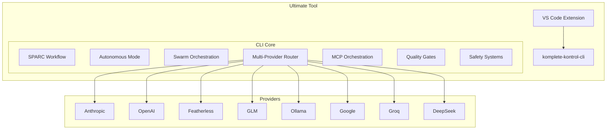

# Ultimate Tool Integration Plan

## Executive Summary

This document outlines the strategy to build the **strongest AI coding assistant available** by combining:

1. **Roo Code's** VS Code integration and SPARC methodology
2. **`/auto`'s** sophisticated autonomy, swarm orchestration, and 40+ specialized tools
3. **komplete-kontrol-cli's** multi-provider support and MCP orchestration

## Critical Discovery: /auto System is MASSIVE

After deep analysis, the `/auto` system has **far more capabilities** than initially documented:

**Additional Commands (24+ total):**
- `/research` - GitHub code search + web search for examples and error solutions
- `/rootcause` - Structured root cause analysis for bugs
- `/security-check` - Pre-production security audit
- `/visionpilot` - Vision-guided computer control (screenshot-driven automation)
- `/build` - Build automation
- `/deploy` - Deployment automation
- `/document` - Documentation generation
- `/validate` - Validation and testing
- `/crawl` - Web crawling
- `/collect` - Data collection
- `/chrome` - Browser automation
- `/checkpoint` - State checkpointing
- Model aliases: `dolphin`, `featherless`, `glm`, `gemini`, `llama8b`, `llama70b`, `qwen`, `kimi`, `opus`, `sonnet`, `whiterabbit`

**Specialized Agents (10+ total):**
- `general-purpose` - Complex multi-step research agent
- `secrets-hunter` - Find exposed credentials and secrets
- `red-teamer` - Adversarial security testing agent
- `build-researcher` - Build research agent
- `config-writer` - Configuration writer agent
- `debug-detective` - Debug detective agent
- `load-profiler` - Load profiler agent
- `qa-explorer` - QA exploration agent
- `Root-cause-analyzer` - Root cause analysis agent
- `validator` - Validator agent

**Specialized Tools:**
- **VisionPilot** - Vision-guided computer control with multi-provider support
- **KenKai Crawler** - Course crawler for Ken Kai's content
- **Web Crawler** - General web scraping tool
- **50+ hooks** - Comprehensive hook system for every aspect of autonomous operation

**This changes the analysis significantly - `/auto` is the most feature-rich system by far.**

**Target Platform**: komplete-kontrol-cli (TypeScript + Bun)

**Rationale**: Build on komplete-kontrol-cli because:
- Modern, maintainable TypeScript codebase
- Already has multi-provider support (10+ providers)
- Already has MCP orchestration (24+ tool servers)
- Designed for extensibility with Phase 2 features planned

---

## Architecture Overview



---

## Feature Matrix

### Source Systems

| Feature | Roo Code | /auto | komplete-kontrol-cli |
|---------|-----------|--------|---------------------|
| VS Code Integration | ✅ | ❌ | ❌ |
| SPARC Methodology | ✅ | ❌ | ❌ |
| ReAct+Reflexion | ❌ | ✅ | ❌ |
| LLM-as-Judge | ✅ | ✅ | ❌ |
| Constitutional AI | ❌ | ✅ | ❌ |
| Tree of Thoughts | ❌ | ✅ | ❌ |
| Bounded Autonomy | ❌ | ✅ | ❌ |
| Swarm Orchestration | ❌ | ✅ | Planned |
| Debug Orchestrator | ❌ | ✅ | ❌ |
| Auto-Checkpoint | ✅ | ✅ | ❌ |
| Multi-Provider | ✅ | Limited | ✅ |
| MCP Orchestration | ✅ | ✅ | ✅ |
| Custom Modes | ✅ | ❌ | Planned |
| Boomerang Tasks | ✅ | ❌ | ❌ |
| UI Testing | ❌ | ✅ | ❌ |
| Mac App Testing | ❌ | ✅ | ❌ |
| GitHub Research | ❌ | ✅ | ❌ |
| Reinforcement Learning | ❌ | ✅ | ❌ |
| Self-Healing Loop | ❌ | ❌ | ✅ |
| Shadow Mode | ❌ | ❌ | ✅ |
| Hook System | ❌ | ✅ | ✅ |
| /research Command | ❌ | ✅ | ❌ |
| /rootcause Command | ❌ | ✅ | ❌ |
| /security-check Command | ❌ | ✅ | ❌ |
| /visionpilot Command | ❌ | ✅ | ❌ |
| /build Command | ❌ | ✅ | ❌ |
| /deploy Command | ❌ | ✅ | ❌ |
| /document Command | ❌ | ✅ | ❌ |
| /validate Command | ❌ | ✅ | ❌ |
| /crawl Command | ❌ | ✅ | ❌ |
| /collect Command | ❌ | ✅ | ❌ |
| /chrome Command | ❌ | ✅ | ❌ |
| /checkpoint Command | ❌ | ✅ | ❌ |
| Model Aliases | ❌ | ✅ | ❌ |
| general-purpose Agent | ❌ | ✅ | ❌ |
| secrets-hunter Agent | ❌ | ✅ | ❌ |
| red-teamer Agent | ❌ | ✅ | ❌ |
| build-researcher Agent | ❌ | ✅ | ❌ |
| config-writer Agent | ❌ | ✅ | ❌ |
| debug-detective Agent | ❌ | ✅ | ❌ |
| load-profiler Agent | ❌ | ✅ | ❌ |
| qa-explorer Agent | ❌ | ✅ | ❌ |
| Root-cause-analyzer Agent | ❌ | ✅ | ❌ |
| validator Agent | ❌ | ✅ | ❌ |
| VisionPilot Tool | ❌ | ✅ | ❌ |
| KenKai Crawler | ❌ | ✅ | ❌ |
| Web Crawler | ❌ | ✅ | ❌ |
| 50+ Hooks | ❌ | ✅ | ❌ |
| Prompting Guide | ❌ | ✅ | ❌ |
| RE Toolkit 50+ Tools | ❌ | ✅ | ❌ |
| Frida Scripts | ❌ | ✅ | ❌ |
| RE Prompts Library | ❌ | ✅ | ❌ |
| RE Skill Script | ❌ | ✅ | ❌ |
| LangGraph Workflows | ❌ | ❌ | Planned |
| DSPy Framework | ❌ | ❌ | Planned |
| Advanced RAG | ❌ | ❌ | Planned |
| AI Observability | ❌ | ❌ | Planned |
| Role-Based Crews | ❌ | ❌ | Planned |
| CI/CD Integration | ❌ | ❌ | Planned |
| AI Code Review | ❌ | ❌ | Planned |
| Codebase Knowledge Graph | ❌ | ❌ | Planned |
| Real-Time Streaming | ❌ | ❌ | Planned |
| Semantic Code Search | ❌ | ❌ | Planned |
| Token Compression | ❌ | ❌ | Planned |
| Semantic Caching | ❌ | ❌ | Planned |
| KV Cache Compression | ❌ | ❌ | Planned |
| Continuous Batching | ❌ | ❌ | Planned |
| Streaming Optimization | ❌ | ❌ | Planned |
| Parallel Agent Execution | ❌ | ❌ | Planned |
| Inference Optimization | ❌ | ❌ | Planned |
| Prompt Tuning & Optimization | ❌ | ❌ | Planned |
| Advanced Context Management | ❌ | ❌ | Planned |
| Auto Context Management | ✅ | ❌ | Planned |
| Enhance Prompt Feature | ✅ | ❌ | Planned |
| Ken Kai's Prompting Guide | ❌ | ✅ | Planned |

---

## Integration Strategy

### Decision: Fork Features, Not Codebases (CLI) | Hybrid Approach (VS Code Extension)

**Why fork features, not entire codebases:**

1. **Roo Code**: VS Code extension architecture doesn't match CLI needs
2. **`/auto`**: Shell script implementation is hard to maintain
3. **komplete-kontrol-cli**: TypeScript + Bun is modern and maintainable

**CLI Integration Approach**: Extract core algorithms and patterns, reimplement in TypeScript

**VS Code Extension Approach**: Hybrid - Fork Roo Code's core infrastructure, rebuild integration layer for komplete-kontrol-cli
- **Keep**: Roo Code's proven UI components (chat panel, file explorer, status bar, etc.)
- **Replace**: Backend integration layer with custom komplete CLI communication
- **Add**: komplete-specific features (multi-provider selector, MCP status, agent UI, streaming)

---

## Phase 1: Roo Code Features (SPARC + VS Code)

### 1.1 SPARC Methodology

**Source**: Roo Code's structured workflow

**Implementation**:
```
src/core/workflows/sparc.ts
├── Specification.ts     // Define requirements
├── Pseudocode.ts       // Generate implementation plan
├── Architecture.ts      // Design system architecture
├── Refinement.ts       // Iterate and improve
└── Completion.ts       // Final implementation
```

**Key Components**:
- Specification generation from user requirements
- Pseudocode generation with step-by-step plan
- Architecture design with component breakdown
- Refinement loop with quality checks
- Completion with validation

**Integration Points**:
- Add to command system: `/sparc <task>`
- Integrate with agent orchestrator
- Use quality gates for each phase

### 1.2 VS Code Extension (Hybrid Approach)

**Source**: Roo Code's VS Code integration (forked core infrastructure)

**Implementation Strategy**: Hybrid Approach - Fork Roo Code's core UI infrastructure, rebuild integration layer for komplete-kontrol-cli

```
┌─────────────────────────────────────────────────────────────┐
│                    Roo Code (Fork)                    │
│  ┌─────────────────────────────────────────────────────┐  │
│  │  Keep: Core infrastructure, UI components       │  │
│  │  - Extension entry point                         │  │
│  │  - Chat panel UI                               │  │
│  │  - File explorer integration                      │  │
│  │  - Status bar indicators                         │  │
│  │  - Webview framework                            │  │
│  └─────────────────────────────────────────────────────┘  │
└────────────────────┬────────────────────────────────────┘
                     │
                     │ Fork + Modify
                     │
                     ▼
┌─────────────────────────────────────────────────────────────┐
│         komplete-kontrol-cli VS Code Extension           │
│  ┌─────────────────────────────────────────────────────┐  │
│  │  Replace: Backend integration                    │  │
│  │  - Remove Roo Code backend calls                │  │
│  │  - Add komplete CLI IPC/HTTP communication      │  │
│  │  - Map komplete commands to VS Code actions     │  │
│  │  - Add komplete-specific UI elements            │  │
│  └─────────────────────────────────────────────────────┘  │
│  ┌─────────────────────────────────────────────────────┐  │
│  │  Add: komplete-specific features               │  │
│  │  - Multi-provider model selector                │  │
│  │  - MCP server status indicators                │  │
│  │  - Agent orchestration UI                    │  │
│  │  - Streaming output display                   │  │
│  └─────────────────────────────────────────────────────┘  │
└─────────────────────────────────────────────────────────────┘
```

**File Structure**:
```
vscode-extension/
├── src/
│   ├── extension.ts        // Main extension entry point (forked from Roo Code)
│   ├── commands/         // VS Code commands (adapted for komplete)
│   ├── panels/           // Side panels, webviews (forked from Roo Code)
│   ├── chat/            // Chat interface (forked from Roo Code)
│   ├── integration/      // komplete CLI integration (NEW - custom built)
│   │   ├── komplete-client.ts    // IPC/HTTP client for komplete CLI
│   │   ├── command-mapper.ts     // Map komplete commands to VS Code
│   │   ├── model-selector.ts     // Multi-provider model selector UI
│   │   ├── mcp-status.ts        // MCP server status indicators
│   │   └── agent-ui.ts         // Agent orchestration UI
│   └── ui/               // komplete-specific UI components (NEW)
│       ├── model-selector.tsx   // Model selector dropdown
│       ├── mcp-status.tsx      // MCP status panel
│       ├── agent-view.tsx       // Agent visualization
│       └── streaming-output.tsx // Streaming token output
├── package.json
└── tsconfig.json
```

**What to Keep from Roo Code Fork**:
- Extension activation and lifecycle
- Chat panel webview
- File tree integration
- Inline code suggestions
- Diff viewer
- Terminal integration
- Status bar items
- Command palette registration

**What to Replace/Rebuild**:
- Remove Roo Code's agent system calls
- Replace with komplete CLI communication layer
- Implement IPC/HTTP client for komplete
- Map komplete commands to VS Code commands

**What to Add (komplete-Specific)**:
- Multi-provider model selector dropdown
- MCP server status panel
- Agent swarm visualization
- Streaming token output
- Real-time progress tracking
- Custom mode switcher UI

**Key Features**:
- Chat panel for interacting with komplete (forked from Roo Code)
- File explorer integration (forked from Roo Code)
- Inline code suggestions (forked from Roo Code)
- Diff viewer for changes (forked from Roo Code)
- Terminal integration (forked from Roo Code)
- Status bar indicators (forked from Roo Code)
- Multi-provider model selector (NEW - komplete-specific)
- MCP server status indicators (NEW - komplete-specific)
- Agent orchestration UI (NEW - komplete-specific)
- Streaming output display (NEW - komplete-specific)

**Integration Points**:
- Communicate with komplete CLI via IPC or HTTP (NEW - custom integration layer)
- Forward commands to komplete (NEW - custom command mapping)
- Display komplete responses in UI (adapted from Roo Code)
- Show agent status and progress (NEW - komplete-specific)

**Benefits of Hybrid Approach**:
- Speed: Leverage proven UI infrastructure from Roo Code
- Quality: Battle-tested extension patterns
- Flexibility: Full control over komplete integration
- Maintainability: Clean separation between UI and backend
- Future-proof: Easy to update UI independently of komplete CLI

### 1.3 Custom Modes

**Source**: Roo Code's mode system

**Implementation**:
```
src/core/modes/
├── Architect.ts        // Planning and design
├── Code.ts            // Implementation
├── Debug.ts           // Troubleshooting
├── Ask.ts             // Q&A and explanations
└── Orchestrator.ts    // Task coordination
```

**Mode Behaviors**:
- **Architect**: Focus on planning, diagrams, architecture
- **Code**: Focus on implementation, refactoring
- **Debug**: Focus on troubleshooting, error analysis
- **Ask**: Focus on explanations, documentation
- **Orchestrator**: Coordinate across modes

**Integration Points**:
- Add `/mode <name>` command
- Each mode has specialized prompts and tools
- Mode switching preserves context

### 1.4 Boomerang Tasks

**Source**: Roo Code's cross-mode workflows

**Implementation**:
```
src/core/tasks/boomerang.ts
├── TaskDefinition.ts   // Define task with mode requirements
├── ModeSwitcher.ts     // Handle mode transitions
├── ContextIsolation.ts // Isolate contexts between modes
└── ResultAggregator.ts // Combine results from modes
```

**Workflow**:
1. Start in Architect mode (plan)
2. Switch to Code mode (implement)
3. Switch to Debug mode (test)
4. Switch back to Architect (review)
5. Aggregate results

**Integration Points**:
- Add `/boomerang <task>` command
- Use with agent orchestrator
- Maintain isolated contexts per mode

---

## Phase 2: /auto Features (Autonomy + Swarm)

### 2.1 ReAct+Reflexion Pattern

**Source**: `/auto` hooks/react-reflexion.sh

**Implementation**:
```
src/core/agents/reflexion.ts
├── Think.ts            // Generate reasoning
├── Act.ts             // Execute action
├── Observe.ts         // Record outcome
└── Reflect.ts         // Learn from outcome
```

**Pattern**:
```typescript
async function reactReflexion(goal: string, context: Context) {
  // THINK
  const reasoning = await think(goal, context);
  
  // ACT
  const action = await act(reasoning);
  
  // OBSERVE
  const outcome = await observe(action);
  
  // REFLECT
  const lesson = await reflect(reasoning, action, outcome);
  
  return { action, outcome, lesson };
}
```

**Integration Points**:
- Add to agent execution loop
- Use for every agent action
- Store reflections in memory

### 2.2 LLM-as-Judge (Quality Gates)

**Source**: `/auto` hooks/auto-evaluator.sh

**Implementation**:
```
src/core/quality/judge.ts
├── Evaluator.ts        // Evaluate output quality
├── Scorer.ts          // Calculate score (0-10)
├── Reviser.ts         // Revise if score < 7.0
└── Gate.ts            // Gate based on score
```

**Evaluation Criteria**:
- Code correctness
- Best practices
- Error handling
- Testing coverage
- Documentation
- Performance

**Integration Points**:
- Run after every significant output
- Auto-revise if score < 7.0
- Use in SPARC refinement phase

### 2.3 Constitutional AI

**Source**: `/auto` hooks/constitutional-ai.sh

**Implementation**:
```
src/core/safety/constitutional.ts
├── Critique.ts         // Check against principles
├── Principles.ts       // Define safety principles
├── Reviser.ts         // Revise if violations
└── Auditor.ts          // Audit all outputs
```

**Principles**:
- Security: No vulnerabilities
- Quality: Follow best practices
- Testing: Include tests
- Error Handling: Proper error management
- Documentation: Document code

**Integration Points**:
- Run after code generation
- Auto-revise if violations found
- Use in autonomous mode

### 2.4 Tree of Thoughts

**Source**: `/auto` hooks/tree-of-thoughts.sh

**Implementation**:
```
src/core/reasoning/tree-of-thoughts.ts
├── Generator.ts        // Generate multiple approaches
├── Evaluator.ts        // Evaluate each approach
├── Ranker.ts          // Rank by score
└── Selector.ts        // Select best approach
```

**When to Use**:
- Tests failing after 2 attempts
- Multiple valid approaches exist
- High complexity/risk task
- Novel problem

**Integration Points**:
- Use when agent is stuck
- Use for complex tasks
- Use in autonomous mode

### 2.5 Bounded Autonomy

**Source**: `/auto` hooks/bounded-autonomy.sh

**Implementation**:
```
src/core/safety/bounded-autonomy.ts
├── Checker.ts          // Check action boundaries
├── Escalator.ts       // Escalate to user
├── Prohibitions.ts     // Define prohibited actions
└── Approvals.ts       // Track required approvals
```

**Prohibited Actions**:
- Force push to main/master
- Bypass security checks (--no-verify)
- Expose secrets/credentials
- Delete production data
- Deploy to production

**Integration Points**:
- Check before every action
- Escalate if approval needed
- Use in autonomous mode

### 2.6 Swarm Orchestration

**Source**: `/auto` hooks/swarm-orchestrator.sh

**Implementation**:
```
src/core/agents/swarm.ts
├── Spawner.ts          // Spawn multiple agents
├── Decomposer.ts       // Decompose task
├── Coordinator.ts      // Coordinate agents
├── Merger.ts           // Merge results
└── GitIntegration.ts    // Git merge with conflict resolution
```

**Decomposition Strategies**:
1. **Feature Implementation**: Design → Implement → Test → Integrate
2. **Testing/Validation**: Parallel independent tests
3. **Refactoring**: Sequential modules with dependencies
4. **Research/Analysis**: Parallel investigation
5. **Generic Parallel**: Equal distribution

**Git Integration**:
- Per-agent temporary branches
- Conflict detection
- Auto-resolution for safe files
- Integration report

**Integration Points**:
- Add `/swarm spawn N <task>` command
- Use for parallelizable tasks
- Auto-spawn when 3+ independent groups detected

### 2.7 Debug Orchestrator

**Source**: `/auto` hooks/debug-orchestrator.sh

**Implementation**:
```
src/core/debug/orchestrator.ts
├── Snapshotter.ts      // Create before/after snapshots
├── Memory.ts           // Bug fix memory bank
├── Searcher.ts         // Search similar bugs
├── Verifier.ts         // Verify fix, detect regressions
└── Recommender.ts      // Recommend alternative approaches
```

**Workflow**:
1. Before fix: Create snapshot, search memory
2. Apply fix
3. After fix: Create snapshot, verify, detect regressions
4. If regression: Recommend revert
5. If clean: Record to memory

**Integration Points**:
- Use for every bug fix
- Integrate with agent system
- Use in autonomous mode

### 2.8 Auto-Checkpoint

**Source**: `/auto` hooks/auto-checkpoint.sh

**Implementation**:
```
src/core/checkpoint/auto.ts
├── Trigger.ts          // Detect checkpoint triggers
├── Saver.ts           // Save state
├── Rollback.ts         // Rollback to checkpoint
└── Manager.ts          // Manage checkpoints
```

**Triggers**:
- 10 file changes
- 40% context usage
- Build section complete
- Explicit command

**Integration Points**:
- Auto-trigger in autonomous mode
- Use `/checkpoint` command
- Integrate with agent system

### 2.9 UI Testing

**Source**: `/auto` hooks/ui-test-framework.sh

**Implementation**:
```
src/core/testing/ui.ts
├── Generator.ts        // Generate tests from pages
├── Executor.ts         // Execute tests via MCP
├── Recorder.ts         // Record GIF/screenshots
└── Regression.ts       // Visual regression testing
```

**Integration Points**:
- Use Claude in Chrome MCP
- Run after UI changes
- Generate tests for new features

### 2.10 GitHub Research

**Source**: `/auto` hooks/github-research-executor.sh

**Implementation**:
```
src/core/research/github.ts
├── Detector.ts         // Detect unfamiliar libraries
├── Searcher.ts         // Search GitHub
├── Analyzer.ts         // Analyze results
└── Recommender.ts      // Recommend examples
```

**Detected Libraries**:
- stripe, oauth, firebase, graphql
- websocket, redis, jwt, postgres
- mongodb, grpc, kafka, twilio
- sendgrid, s3, lambda

**Integration Points**:
- Auto-detect in tasks
- Search before implementation
- Provide code examples

### 2.11 Reinforcement Learning

**Source**: `/auto` hooks/reinforcement-learning.sh

**Implementation**:
```
src/core/learning/reinforcement.ts
├── Tracker.ts          // Track outcomes
├── Analyzer.ts         // Analyze patterns
├── Recommender.ts      // Recommend approaches
└── Memory.ts          // Store learned patterns
```

**Integration Points**:
- Track every action outcome
- Recommend based on history
- Use in agent decision making

### 2.12 Specialized Commands

**Source**: `/auto` commands directory

#### `/research` Command

**Implementation**:
```
src/commands/research.ts
├── GitHubSearch.ts     // Search GitHub for code examples
├── WebSearch.ts        // Search web for error solutions
├── Analyzer.ts         // Analyze and recommend examples
└── PatternDetector.ts  // Detect implementation patterns
```

**Features**:
- GitHub code search using grep.app MCP
- Web search for error solutions
- Pattern detection for common implementations
- Example recommendation system

**Integration Points**:
- Add `/research <query>` command
- Auto-trigger for unfamiliar libraries
- Integrate with agent workflow

#### `/rootcause` Command

**Implementation**:
```
src/commands/rootcause.ts
├── HypothesisGenerator.ts  // Generate hypotheses
├── ExperimentDesigner.ts    // Design verification experiments
├── Verifier.ts            // Verify hypotheses
└── Reporter.ts            // Generate root cause report
```

**Features**:
- Structured root cause analysis
- Hypothesis-driven debugging
- Experiment design and verification
- Comprehensive reporting

**Integration Points**:
- Add `/rootcause <issue>` command
- Use for complex bugs
- Integrate with debug orchestrator

#### `/security-check` Command

**Implementation**:
```
src/commands/security-check.ts
├── SecretsDetector.ts     // Detect exposed secrets
├── InjectionScanner.ts    // Scan for SQL/XSS injection
├── AuthChecker.ts        // Check authentication/authorization
├── DependencyScanner.ts   // Scan for vulnerable dependencies
└── Reporter.ts           // Generate security report
```

**Features**:
- Secrets exposure detection
- SQL injection, XSS scanning
- Authentication/authorization checks
- Dependency vulnerability scanning
- Pre-production security audit

**Integration Points**:
- Add `/security-check` command
- Run before deployment
- Integrate with CI/CD pipeline

#### `/visionpilot` Command

**Implementation**:
```
src/commands/visionpilot.ts
├── VisionController.ts    // Vision-guided control
├── ScreenshotAnalyzer.ts  // Analyze screenshots
├── ActionExecutor.ts     // Execute actions based on vision
└── MultiProvider.ts      // Support multiple vision providers
```

**Features**:
- Vision-guided computer control
- Screenshot-driven automation
- Multi-provider support (Gemini, Claude, GPT-4o, Featherless)
- Adobe Premiere Pro automation

**Integration Points**:
- Add `/visionpilot <task>` command
- Integrate VisionPilot Python tool
- Use for GUI automation

#### `/build` Command

**Implementation**:
```
src/commands/build.ts
├── Builder.ts           // Execute build
├── ErrorHandler.ts      // Handle build errors
├── RetryLogic.ts       // Retry failed builds
└── Reporter.ts         // Generate build report
```

**Features**:
- Build automation
- Error handling and recovery
- Build caching
- Parallel builds

**Integration Points**:
- Add `/build` command
- Integrate with agent workflow
- Use in autonomous mode

#### `/deploy` Command

**Implementation**:
```
src/commands/deploy.ts
├── Deployer.ts          // Execute deployment
├── Rollback.ts          // Rollback if needed
├── HealthCheck.ts       // Check deployment health
└── Reporter.ts          // Generate deployment report
```

**Features**:
- Deployment automation
- Automatic rollback on failure
- Health checks
- Multi-environment support

**Integration Points**:
- Add `/deploy <env>` command
- Integrate with bounded autonomy
- Use in autonomous mode

#### `/document` Command

**Implementation**:
```
src/commands/document.ts
├── DocGenerator.ts      // Generate documentation
├── MarkdownWriter.ts    // Write markdown docs
├── DocstringWriter.ts   // Write code docstrings
└── READMEGenerator.ts   // Generate README files
```

**Features**:
- Auto-documentation generation
- Markdown support
- Docstring generation
- README generation

**Integration Points**:
- Add `/document <target>` command
- Run after code changes
- Integrate with quality gates

#### `/validate` Command

**Implementation**:
```
src/commands/validate.ts
├── Validator.ts         // Validate outputs
├── TestGenerator.ts     // Generate tests
├── TestRunner.ts       // Run tests
└── Reporter.ts         // Generate validation report
```

**Features**:
- Output validation
- Test generation
- Test execution
- Validation reporting

**Integration Points**:
- Add `/validate <target>` command
- Use in autonomous mode
- Integrate with quality gates

#### `/crawl` Command

**Implementation**:
```
src/commands/crawl.ts
├── Crawler.ts          // Web crawler
├── ContentExtractor.ts  // Extract content
├── LinkFollower.ts     // Follow links
└── DataStore.ts        // Store crawled data
```

**Features**:
- Web crawling
- Content extraction
- Link following
- Data storage

**Integration Points**:
- Add `/crawl <url>` command
- Use for research tasks
- Integrate with agent workflow

#### `/collect` Command

**Implementation**:
```
src/commands/collect.ts
├── Collector.ts        // Data collector
├── Structurer.ts       // Structure data
├── Validator.ts       // Validate data
└── Exporter.ts        // Export data
```

**Features**:
- Data collection
- Data structuring
- Data validation
- Data export

**Integration Points**:
- Add `/collect <source>` command
- Use for data gathering
- Integrate with agent workflow

#### `/chrome` Command

**Implementation**:
```
src/commands/chrome.ts
├── Browser.ts          // Chrome browser control
├── PageLoader.ts       // Load pages
├── Interactor.ts       // Interact with pages
└── Screenshotter.ts    // Take screenshots
```

**Features**:
- Chrome DevTools Protocol
- Headless browser support
- Page interaction
- Screenshot capture

**Integration Points**:
- Add `/chrome <url>` command
- Use for browser automation
- Integrate with UI testing

#### `/checkpoint` Command

**Implementation**:
```
src/commands/checkpoint.ts
├── Checkpointer.ts     // Create checkpoint
├── Restorer.ts         // Restore from checkpoint
├── Lister.ts           // List checkpoints
└── Deleter.ts          // Delete checkpoints
```

**Features**:
- Manual checkpoint creation
- Checkpoint restoration
- Checkpoint listing
- Checkpoint deletion

**Integration Points**:
- Add `/checkpoint` command
- Integrate with auto-checkpoint
- Use for state management

#### Model Aliases

**Implementation**:
```
src/models/aliases.ts
├── AliasRegistry.ts    // Registry of model aliases
├── Resolver.ts         // Resolve aliases to models
├── Router.ts           // Route to correct provider
└── Config.ts           // Alias configuration
```

**Features**:
- Quick model switching
- Alias: `dolphin` → Featherless dolphin-2.9.2-llama3-70b
- Alias: `featherless` → Featherless default
- Alias: `glm` → GLM-4
- Alias: `gemini` → Google Gemini
- Alias: `llama8b` → Featherless llama-3-8b
- Alias: `llama70b` → Featherless llama-3-70b
- Alias: `qwen` → Qwen
- Alias: `kimi` → Kimi
- Alias: `opus` → Claude Opus
- Alias: `sonnet` → Claude Sonnet
- Alias: `whiterabbit` → White Rabbit

**Integration Points**:
- Add model alias support to CLI
- Use in commands: `/dolphin <task>`
- Integrate with provider router

### 2.13 Specialized Agents

**Source**: `/auto` agents directory

#### `general-purpose` Agent

**Implementation**:
```
src/agents/general-purpose.ts
├── Searcher.ts         // Search for information
├── Reader.ts           // Read and understand
├── Executor.ts         // Execute tasks
└── Verifier.ts        // Verify results
```

**Features**:
- Complex multi-step research
- Search, read, execute, verify workflow
- Task decomposition
- Result aggregation

**Integration Points**:
- Add `/agent general-purpose <task>` command
- Use for research tasks
- Integrate with swarm orchestration

#### `secrets-hunter` Agent

**Implementation**:
```
src/agents/secrets-hunter.ts
├── GitScanner.ts       // Scan git history
├── PatternMatcher.ts   // Match secret patterns
├── FileScanner.ts      // Scan current files
└── Reporter.ts         // Generate report
```

**Features**:
- Find exposed credentials and secrets
- Git history analysis
- Pattern matching for API keys, tokens, passwords
- Comprehensive reporting

**Integration Points**:
- Add `/agent secrets-hunter` command
- Use in security checks
- Integrate with security-check command

#### `red-teamer` Agent

**Implementation**:
```
src/agents/red-teamer.ts
├── Attacker.ts         // Execute attacks
├── InjectionTester.ts  // Test for injection vulnerabilities
├── AuthTester.ts       // Test authentication
├── AuthzTester.ts      // Test authorization
└── BusinessLogicTester.ts // Test business logic
```

**Features**:
- Adversarial security testing
- SQL injection, XSS attacks
- Authentication/authorization testing
- Business logic vulnerability testing

**Integration Points**:
- Add `/agent red-teamer` command
- Use in security audits
- Integrate with security-check command

#### `build-researcher` Agent

**Implementation**:
```
src/agents/build-researcher.ts
├── BuildAnalyzer.ts    // Analyze build system
├── ErrorResolver.ts    // Resolve build errors
├── DependencyResolver.ts // Resolve dependencies
└── Optimizer.ts        // Optimize build
```

**Features**:
- Build system research
- Build error resolution
- Dependency analysis
- Build optimization

**Integration Points**:
- Add `/agent build-researcher` command
- Use for build issues
- Integrate with build command

#### `config-writer` Agent

**Implementation**:
```
src/agents/config-writer.ts
├── ConfigGenerator.ts  // Generate config files
├── Validator.ts        // Validate configs
├── Templater.ts        // Use config templates
└── Writer.ts           // Write config files
```

**Features**:
- Configuration file generation
- Config validation
- Config templates
- Multi-format support

**Integration Points**:
- Add `/agent config-writer` command
- Use for config tasks
- Integrate with agent workflow

#### `debug-detective` Agent

**Implementation**:
```
src/agents/debug-detective.ts
├── BugFinder.ts        // Find bugs
├── PatternRecognizer.ts // Recognize bug patterns
├── HypothesisGenerator.ts // Generate hypotheses
└── FixRecommender.ts   // Recommend fixes
```

**Features**:
- Systematic debugging
- Bug pattern recognition
- Hypothesis generation
- Fix recommendation

**Integration Points**:
- Add `/agent debug-detective` command
- Use for debugging tasks
- Integrate with debug orchestrator

#### `load-profiler` Agent

**Implementation**:
```
src/agents/load-profiler.ts
├── Profiler.ts         // Profile performance
├── BottleneckFinder.ts // Find bottlenecks
├── Optimizer.ts        // Optimize performance
└── Reporter.ts         // Generate report
```

**Features**:
- Load profiling
- Bottleneck detection
- Performance optimization
- Comprehensive reporting

**Integration Points**:
- Add `/agent load-profiler` command
- Use for performance tasks
- Integrate with agent workflow

#### `qa-explorer` Agent

**Implementation**:
```
src/agents/qa-explorer.ts
├── TestDiscoverer.ts   // Discover tests
├── TestGenerator.ts    // Generate tests
├── TestRunner.ts       // Run tests
└── CoverageAnalyzer.ts  // Analyze coverage
```

**Features**:
- QA exploration
- Test discovery
- Test generation
- Coverage analysis

**Integration Points**:
- Add `/agent qa-explorer` command
- Use for QA tasks
- Integrate with validate command

#### `Root-cause-analyzer` Agent

**Implementation**:
```
src/agents/root-cause-analyzer.ts
├── Analyzer.ts         // Analyze issues
├── HypothesisGenerator.ts // Generate hypotheses
├── ExperimentDesigner.ts // Design experiments
└── Verifier.ts         // Verify root cause
```

**Features**:
- Root cause analysis
- Hypothesis-driven analysis
- Experiment design
- Root cause verification

**Integration Points**:
- Add `/agent root-cause-analyzer` command
- Use for complex issues
- Integrate with rootcause command

#### `validator` Agent

**Implementation**:
```
src/agents/validator.ts
├── Validator.ts        // Validate outputs
├── Checker.ts          // Check against requirements
├── Reporter.ts         // Generate report
└── Reviser.ts          // Revise if needed
```

**Features**:
- Output validation
- Requirement checking
- Validation reporting
- Auto-revision

**Integration Points**:
- Add `/agent validator` command
- Use for validation tasks
- Integrate with quality gates

### 2.14 Specialized Tools

**Source**: `/auto` tools directory

#### VisionPilot

**Implementation**:
```
src/tools/visionpilot/
├── controller.ts       // Vision controller
├── analyzer.ts        // Screenshot analyzer
├── executor.ts        // Action executor
├── providers/         // Multi-provider support
│   ├── gemini.ts
│   ├── claude.ts
│   ├── gpt4o.ts
│   └── featherless.ts
└── python/            // Python VisionPilot integration
    ├── visionpilot.py
    └── requirements.txt
```

**Features**:
- Vision-guided computer control
- Screenshot-driven automation
- Multi-provider support
- Adobe Premiere Pro automation
- Python virtual environment

**Integration Points**:
- Integrate with visionpilot command
- Use for GUI automation
- Support multiple vision providers

#### KenKai Crawler

**Implementation**:
```
src/tools/kenkai/
├── crawler.ts         // Course crawler
├── parser.ts          // Parse course content
├── downloader.ts      // Download content
└── organizer.ts       // Organize content
```

**Features**:
- Course crawler for Ken Kai's content
- Content parsing
- Content downloading
- Content organization

**Integration Points**:
- Add `/kenkai crawl` command
- Use for course content
- Integrate with agent workflow

#### Web Crawler

**Implementation**:
```
src/tools/crawler/
├── crawler.ts         // Web crawler
├── parser.ts          // Parse web content
├── extractor.ts       // Extract data
└── storage.ts        // Store data
```

**Features**:
- General web scraping
- Content parsing
- Data extraction
- Data storage

**Integration Points**:
- Integrate with crawl command
- Use for web scraping
- Support multiple formats

#### Hook System (50+ Hooks)

**Implementation**:
```
src/hooks/
├── pre-execution/     // Before execution
├── post-execution/    // After execution
├── error-handling/    // Error handling
├── state-management/  // State management
├── quality-control/   // Quality control
├── safety-checks/     // Safety checks
├── memory-management/ // Memory management
├── context-management/ // Context management
├── agent-lifecycle/   // Agent lifecycle
└── tool-execution/    // Tool execution
```

**Features**:
- 50+ hooks for every aspect of operation
- Pre/post execution hooks
- Error handling hooks
- State management hooks
- Quality control hooks
- Safety check hooks
- Memory management hooks
- Context management hooks
- Agent lifecycle hooks
- Tool execution hooks

**Integration Points**:
- Integrate with all components
- Use for extensibility
- Support custom hooks

### 2.15 Prompting Guide

**Source**: `/auto` docs/prompting-guide.md

**Implementation**:
```
src/core/prompting/
├── Principles.ts       // Core prompting principles
├── DesignSpeak.ts     // Design terminology
├── CodeSpeak.ts       // Code terminology
├── Patterns.ts        // Effective prompt patterns
└── Context.ts        // Context management strategies
```

**Features**:
- Core principles: Short > Long, Don't Dump, Manage Context, Focused Sets
- Design Speak: layout, spacing, colors, typography, components, hierarchy
- Code Speak: data, actions, flow, structure, errors, functions, variables
- Effective prompt patterns
- Feedback patterns for troubleshooting
- Context management strategies

**Integration Points**:
- Use in agent system prompts
- Use in command generation
- Use in quality evaluation
- Train models on effective patterns

### 2.16 Reverse Engineering Toolkit

**Source**: `/auto` docs/reverse-engineering-toolkit.md

**Implementation**:
```
src/core/reverse/
├── toolkit/
│   ├── Network/
│   │   ├── mitmproxy.ts
│   │   ├── burp-suite.ts
│   │   ├── charles-proxy.ts
│   │   ├── wireshark.ts
│   │   └── ja3-fingerprint.ts
│   ├── API/
│   │   ├── kiterunner.ts
│   │   ├── restler.ts
│   │   └── schemathesis.ts
│   ├── Protocol/
│   │   ├── protobuf.ts
│   │   ├── grpc.ts
│   │   └── graphql.ts
│   ├── Mobile/
│   │   ├── jadx.ts
│   │   ├── frida.ts
│   │   └── objection.ts
│   ├── Binary/
│   │   ├── ghidra.ts
│   │   ├── radare2.ts
│   │   ├── dnspy.ts
│   │   ├── ilspy.ts
│   │   └── wabt.ts
│   ├── OS/
│   │   ├── volatility.ts
│   │   ├── binwalk.ts
│   │   ├── qemu.ts
│   │   ├── gdb.ts
│   │   ├── windbg.ts
│   │   ├── scyllahide.ts
│   │   ├── cheat-engine.ts
│   │   └── saleae.ts
│   ├── Web/
│   │   ├── devtools.ts
│   │   ├── ast-explorer.ts
│   │   ├── screenshot-to-code.ts
│   │   ├── v0-dev.ts
│   │   └── puppeteer-stealth.ts
│   └── Workflows/
│       ├── mobile-app-re.ts
│       ├── api-re.ts
│       ├── firmware-re.ts
│       └── binary-protocol-re.ts
```

**Features**:
- **Network & API Interception**: mitmproxy, Burp Suite, Charles Proxy, Wireshark, JA3 Fingerprint Analysis
- **API Discovery & Fuzzing**: Kiterunner, RESTler, Schemathesis
- **Protocol Analysis**: Protobuf (pbtk), gRPC (mitmproxy-grpc, BloomRPC), GraphQL (InQL, Clairvoyance, Apollo DevTools)
- **Mobile App Analysis**: JADX, Frida, Objection
- **Binary Analysis**: Ghidra, Radare2, dnSpy, ILSpy, WABT
- **OS & Kernel Analysis**: Volatility 3, Binwalk, QEMU, GDB, WinDbg, ScyllaHide, Cheat Engine, Saleae Logic
- **Web Frontend & AI Tools**: Chrome DevTools, AST Explorer, screenshot-to-code, v0.dev, puppeteer-stealth
- **Sequential Workflows**: Tool chaining for complex RE tasks
- **Advanced Patterns**: Ghidra headless, mitmproxy Docker, JADX advanced, Protobuf schema recovery

**Integration Points**:
- Add MCP servers for each tool
- Integrate with agent system
- Use for reverse engineering tasks
- Support tool chaining workflows

### 2.17 Frida Scripts

**Source**: `/auto` docs/frida-scripts.md

**Implementation**:
```
src/core/reverse/frida/
├── scripts/
│   ├── android/
│   │   ├── ssl-pinning-bypass.ts
│   │   ├── root-detection-bypass.ts
│   │   ├── debugger-detection-bypass.ts
│   │   ├── enumerate-classes.ts
│   │   └── hook-http-requests.ts
│   ├── ios/
│   │   ├── ssl-pinning-bypass.ts
│   │   ├── jailbreak-detection-bypass.ts
│   │   └── crypto-interception.ts
│   ├── native/
│   │   ├── hook-native-functions.ts
│   │   ├── memory-search-and-patch.ts
│   │   └── hex-dump-helper.ts
│   └── utility/
│       ├── stack-trace-helper.ts
│       └── access-stat-bypass.ts
└── templates/
    ├── ios-access-stat-bypass.ts
    ├── android-crypto-key-interception.ts
    ├── ios-keychain-interception.ts
    └── dynamic-library-loading-bypass.ts
```

**Features**:
- **Android Scripts**: SSL Pinning Bypass, Root Detection Bypass, Debugger Detection Bypass, Enumerate All Classes, Hook HTTP Requests
- **iOS Scripts**: SSL Pinning Bypass, Jailbreak Detection Bypass, Crypto Interception (CCCrypt)
- **Native Hooks**: Hook Native Functions, Memory Search and Patch
- **Utility Functions**: Hex Dump Helper, Stack Trace Helper
- **Advanced Patterns**: iOS Access/Stat Bypass, Android Crypto Key Interception, iOS Keychain Interception, Dynamic Library Loading Bypass

**Integration Points**:
- Add MCP server for Frida
- Integrate with mobile RE workflows
- Use for dynamic analysis
- Support script templates

### 2.18 Reverse Engineering Prompts

**Source**: `/auto` docs/re-prompts.md

**Implementation**:
```
src/core/reverse/prompts/
├── chrome-extensions/
│   ├── extract-extension.md
│   ├── analyze-extension.md
│   └── find-extension-id.md
├── electron-apps/
│   ├── extract-app.md
│   ├── analyze-source.md
│   └── find-main-entry.md
├── javascript/
│   ├── beautify-code.md
│   ├── deep-analysis.md
│   ├── find-hidden-functionality.md
│   └── reconstruct-logic.md
├── macos-apps/
│   ├── explore-bundle.md
│   ├── extract-resources.md
│   └── analyze-info-plist.md
├── re-tools/
│   ├── setup-ghidra.md
│   ├── frida-hook-script.md
│   └── ssl-bypass.md
├── automation/
│   ├── dns-benchmark.md
│   ├── network-diagnostics.md
│   ├── system-info-script.md
│   └── file-automation.md
├── web-scraping/
│   ├── simple-scraper.md
│   ├── authenticated-scraper.md
│   ├── dynamic-content.md
│   └── anti-detection-scraper.md
├── api-reverse-engineering/
│   ├── traffic-capture.md
│   ├── analyze-captured-traffic.md
│   ├── build-api-client.md
│   └── decode-binary-protocol.md
├── browser-automation/
│   ├── generic-automation.md
│   ├── login-action.md
│   ├── monitoring-script.md
│   ├── form-automation.md
│   └── pdf-download.md
├── quick-commands.md
├── troubleshooting.md
├── professional-tools.md
├── tool-combinations.md
└── sequential-workflows.md
```

**Features**:
- **Chrome Extensions**: Extract, analyze, find extension ID
- **Electron Apps**: Extract, analyze source, find main entry
- **JavaScript Deobfuscation**: Beautify, deep analysis, find hidden functionality, reconstruct logic
- **macOS Apps**: Explore bundle, extract resources, analyze Info.plist
- **RE Tools**: Setup Ghidra, Frida hook scripts, SSL bypass
- **Automation**: DNS benchmark, network diagnostics, system info, file automation
- **Web Scraping**: Simple, authenticated, dynamic content, anti-detection
- **API Reverse Engineering**: Traffic capture, analyze captured traffic, build API client, decode binary protocol
- **Browser Automation**: Generic, login+action, monitoring, form automation, PDF/download
- **50+ Professional RE Tools**: Detailed prompts for each tool
- **Tool Combinations**: Workflows combining multiple tools
- **Sequential Workflows**: Tool chaining for complex tasks

**Integration Points**:
- Use in agent system for RE tasks
- Provide copy-paste prompts for users
- Integrate with RE Toolkit
- Support workflow automation

### 2.19 Reverse Engineering Skill Script

**Source**: `/auto` skills/re.sh

**Implementation**:
```
src/core/reverse/skill/
├── re-skill.ts
├── chrome-extension/
│   ├── extractor.ts
│   ├── crx-parser.ts
│   └── analyzer.ts
├── electron-app/
│   ├── extractor.ts
│   ├── asar-parser.ts
│   └── analyzer.ts
├── javascript/
│   ├── deobfuscator.ts
│   └── analyzer.ts
├── macos-app/
│   ├── explorer.ts
│   ├── plist-parser.ts
│   └── analyzer.ts
├── api-research/
│   ├── starter.ts
│   ├── template-generator.ts
│   └── config-generator.ts
└── auto-detect/
    ├── detector.ts
    └── analyzer.ts
```

**Features**:
- `re.sh chrome <path>` - Extract and analyze Chrome extensions
  - CRX file handling (CRX2/CRX3 formats)
  - Extension ID lookup
  - Manifest analysis
  - Suspicious pattern detection
- `re.sh electron <app>` - Extract Electron app source
  - ASAR extraction
  - package.json parsing
  - Dependency analysis
  - IPC/preload detection
- `re.sh deobfuscate <file>` - Beautify/deobfuscate JavaScript
  - js-beautify integration
  - Pattern detection (eval, Function, URLs, API endpoints)
  - Analysis JSON output
- `re.sh macos <app>` - Explore macOS app bundle
  - Info.plist parsing
  - Resource enumeration
  - Framework detection
  - URL schemes
- `re.sh api <url>` - Start API reverse engineering
  - Research template creation
  - Config generation
- `re.sh analyze <path>` - Auto-detect target type and analyze
  - Automatic target type detection
  - Appropriate extraction method selection

**Integration Points**:
- Add `/re chrome <path>` command
- Add `/re electron <app>` command
- Add `/re deobfuscate <file>` command
- Add `/re macos <app>` command
- Add `/re api <url>` command
- Add `/re analyze <path>` command
- Integrate with agent system
- Output to `~/Desktop/re-output/`
- Log to `~/.claude/logs/re-skill.log`

### 2.20 LangGraph Workflows

**Source**: LangGraph framework (langchain-ai/langgraph on GitHub)

**Implementation**:
```
src/core/workflows/langgraph/
├── GraphBuilder.ts      // Build workflow graphs
├── StateManager.ts     // Manage workflow state
├── NodeExecutor.ts     // Execute individual nodes
├── EdgeRouter.ts       // Route between nodes
├── Visualizer.ts       // Visualize workflow graphs
├── Debugger.ts         // Debug workflow execution
└── Templates/
    ├── sequential.ts    // Sequential workflow template
    ├── parallel.ts      // Parallel workflow template
    ├── conditional.ts   // Conditional workflow template
    └── cyclic.ts       // Cyclic workflow template
```

**Features**:
- Graph-based workflow orchestration with DAG representation
- Stateful workflows that maintain context across steps
- Visual debugging of agent reasoning steps
- Conditional routing based on execution results
- Parallel execution of independent branches
- Cyclic workflows for iterative refinement
- Workflow templates for common patterns
- Checkpoint/resume capability for long-running workflows

**When to Use**:
- Complex multi-step tasks requiring branching logic
- Tasks with conditional execution paths
- Parallel processing of independent subtasks
- Iterative workflows with feedback loops
- Visual debugging of agent reasoning

**Integration Points**:
- Use with swarm orchestration for complex agent coordination
- Integrate with SPARC for structured planning workflows
- Use with debug orchestrator for visual debugging
- Add `/graph <workflow>` command for custom workflows

### 2.21 DSPy Framework

**Source**: DSPy framework (stanfordnlp/dspy on GitHub)

**Implementation**:
```
src/core/learning/dspy/
├── Optimizer.ts        // Auto-optimize prompts
├── PromptCompiler.ts   // Compile declarative prompts
├── MetricEvaluator.ts   // Evaluate prompt performance
├── Teleprompter.ts     // Generate optimized prompts
├── Signature.ts        // Define task signatures
├── Module.ts           // Composable prompt modules
└── Examples/
    ├── qa.ts           // Question-answering module
    ├── summarization.ts // Summarization module
    ├── codegen.ts      // Code generation module
    └── reasoning.ts    // Reasoning module
```

**Features**:
- Declarative prompt optimization ("programming, not prompting")
- Automatic prompt tuning based on task performance
- Self-improving prompts that learn from examples
- Metric-based evaluation (accuracy, latency, cost)
- Composable prompt modules for reuse
- Teleprompter for automatic prompt generation
- Support for few-shot and zero-shot learning
- Reduced manual prompt engineering by 70%

**When to Use**:
- Tasks requiring consistent high-quality outputs
- Complex prompting patterns that need optimization
- Tasks with many examples for learning
- Reducing manual prompt engineering effort
- Improving prompt performance over time

**Integration Points**:
- Use with LLM-as-Judge for automatic optimization
- Integrate with agent system for self-improving agents
- Use with quality gates for continuous improvement
- Add `/optimize <task>` command for prompt optimization

### 2.22 Advanced RAG with Vector Databases

**Source**: RAG implementations on GitHub (chroma, pinecone, qdrant)

**Implementation**:
```
src/core/rag/
├── VectorStore.ts      // Vector database interface
├── Embedder.ts         // Generate embeddings
├── Retriever.ts        // Retrieve relevant documents
├── Reranker.ts         // Rerank retrieved documents
├── Augmenter.ts        // Augment prompts with context
├── Chunker.ts          // Split documents into chunks
├── Providers/
│   ├── chroma.ts       // ChromaDB integration
│   ├── pinecone.ts     // Pinecone integration
│   ├── qdrant.ts       // Qdrant integration
│   └── weaviate.ts     // Weaviate integration
└── Strategies/
    ├── semantic.ts      // Semantic similarity search
    ├── hybrid.ts       // Hybrid keyword + semantic
    ├── recursive.ts    // Recursive retrieval
    └── multi-query.ts  // Multi-query retrieval
```

**Features**:
- Semantic retrieval with vector similarity search
- Multiple vector database providers (Chroma, Pinecone, Qdrant, Weaviate)
- Hybrid search combining keyword and semantic matching
- Document chunking with overlap for context preservation
- Reranking of retrieved documents for relevance
- Multi-query retrieval for comprehensive coverage
- Recursive retrieval for complex queries
- 10-12% accuracy improvement over basic RAG

**When to Use**:
- Tasks requiring domain-specific knowledge
- Long-term memory for agents
- Retrieving relevant code examples
- Answering questions about codebase
- Context augmentation for better responses

**Integration Points**:
- Use with agent system for long-term memory
- Integrate with research capabilities for better results
- Use with GitHub research for code example retrieval
- Add `/rag <query>` command for semantic search

### 2.23 AI Observability Platform

**Source**: LangSmith, Arize, Weights & Biases (GitHub)

**Implementation**:
```
src/core/observability/
├── Tracer.ts           // Trace agent execution
├── Metrics.ts          // Collect metrics (latency, cost, tokens)
├── Evaluator.ts        // Evaluate agent performance
├── Dashboard.ts        // Observability dashboard
├── AlertManager.ts     // Alert on anomalies
├── Storage.ts          // Store traces and metrics
├── Analytics.ts        // Analyze agent behavior
└── Reports/
    ├── performance.ts   // Performance reports
    ├── cost.ts         // Cost reports
    ├── errors.ts       // Error reports
    └── insights.ts     // Behavioral insights
```

**Features**:
- Comprehensive tracing of agent execution (tool calls, reasoning steps)
- Real-time metrics collection (latency, cost, token usage)
- Performance evaluation with custom metrics
- Dashboard for visualizing agent behavior
- Anomaly detection and alerting
- Cost tracking and optimization recommendations
- Error analysis and debugging support
- Behavioral insights for agent improvement

**When to Use**:
- Debugging complex agent behaviors
- Monitoring production agent performance
- Optimizing agent costs and latency
- Understanding agent decision-making
- Identifying patterns in agent failures

**Integration Points**:
- Integrate with all agent execution paths
- Use with debug orchestrator for enhanced debugging
- Use with swarm orchestration for multi-agent monitoring
- Add `/observability` command for dashboard access

### 2.24 Role-Based Crews (CrewAI-Style)

**Source**: CrewAI framework (joaomdmoura/crewAI on GitHub)

**Implementation**:
```
src/core/crews/
├── Crew.ts             // Multi-agent crew
├── Role.ts             // Define agent roles
├── Task.ts             // Define tasks for roles
├── Process.ts          // Define crew process (sequential/parallel)
├── Coordinator.ts      // Coordinate crew execution
├── Templates/
│   ├── research-crew.ts    // Research crew template
│   ├── development-crew.ts // Development crew template
│   ├── testing-crew.ts     // Testing crew template
│   └── deployment-crew.ts  // Deployment crew template
└── Roles/
    ├── researcher.ts        // Researcher role
    ├── architect.ts        // Architect role
    ├── developer.ts        // Developer role
    ├── tester.ts           // Tester role
    ├── reviewer.ts         // Reviewer role
    └── deployer.ts         // Deployer role
```

**Features**:
- Role-based multi-agent teams with specialized agents
- Task assignment based on role capabilities
- Sequential and parallel process execution
- Crew-level coordination and communication
- Reusable crew templates for common workflows
- Role-specific tools and prompts
- Hierarchical crew organization (crews within crews)
- Automatic task delegation based on expertise

**When to Use**:
- Complex tasks requiring multiple specialties
- Projects needing end-to-end automation
- Tasks with clear role separation (research, dev, test)
- Parallel execution of independent tasks
- Standardized workflows with consistent roles

**Integration Points**:
- Use with swarm orchestration for enhanced coordination
- Integrate with specialized agents for role definitions
- Use with boomerang tasks for cross-role workflows
- Add `/crew <template>` command for crew execution

### 2.25 CI/CD Integration

**Source**: GitHub Actions, GitLab CI, Jenkins integrations

**Implementation**:
```
src/core/cicd/
├── Pipeline.ts         // CI/CD pipeline integration
├── PRReviewer.ts       // AI-powered PR review
├── TestRunner.ts       // Run tests in CI
├── Deployer.ts         // Deploy to environments
├── Rollback.ts         // Automatic rollback on failure
├── Notifier.ts         // Notify on pipeline events
├── Integrations/
│   ├── github.ts       // GitHub Actions integration
│   ├── gitlab.ts       // GitLab CI integration
│   └── jenkins.ts      // Jenkins integration
└── Workflows/
    ├── review-pr.ts     // Review pull requests
    ├── run-tests.ts    // Run test suite
    ├── deploy-staging.ts // Deploy to staging
    └── deploy-prod.ts  // Deploy to production
```

**Features**:
- AI agents integrated into development workflow
- Automated PR review with code analysis
- Test execution and reporting
- Automated deployment to staging/production
- Automatic rollback on deployment failure
- Notification on pipeline events
- Integration with GitHub Actions, GitLab CI, Jenkins
- Pipeline status tracking and reporting

**When to Use**:
- Automating code review process
- Running tests in CI environment
- Deploying applications automatically
- Monitoring pipeline health
- Notifying team on events

**Integration Points**:
- Integrate with agent system for PR review
- Use with quality gates for automated checks
- Use with bounded autonomy for safe deployments
- Add `/cicd review <pr>` command for PR review

### 2.26 AI-Powered Code Review

**Source**: Code review tools (Codacy, SonarQube, GitHub Copilot)

**Implementation**:
```
src/core/review/
├── Reviewer.ts         // AI code reviewer
├── Analyzer.ts         // Analyze code changes
├── SecurityScanner.ts  // Scan for security issues
├── StyleChecker.ts     // Check code style
├── BugDetector.ts      // Detect potential bugs
├── ComplexityAnalyzer.ts // Analyze code complexity
├── Suggester.ts        // Suggest improvements
└── Reports/
    ├── review.ts       // Review report
    ├── security.ts     // Security report
    ├── style.ts        // Style report
    └── bugs.ts         // Bug report
```

**Features**:
- Automated code review with AI analysis
- Security vulnerability scanning (SQL injection, XSS, etc.)
- Code style checking (linting, formatting)
- Bug detection (null pointer, race conditions, etc.)
- Code complexity analysis (cyclomatic complexity, maintainability)
- Improvement suggestions (refactoring, optimization)
- Integration with PR workflows
- Catches 3X more bugs than human reviewers

**When to Use**:
- Reviewing pull requests
- Ensuring code quality standards
- Catching security vulnerabilities
- Identifying potential bugs
- Improving code maintainability

**Integration Points**:
- Use with CI/CD integration for automated review
- Integrate with quality gates for code quality checks
- Use with constitutional AI for safety checks
- Add `/review <pr>` command for manual review

### 2.27 Codebase Knowledge Graph

**Source**: Code graph tools (Sourcegraph, CodeNav, GitHub)

**Implementation**:
```
src/core/knowledge-graph/
├── GraphBuilder.ts     // Build code knowledge graph
├── NodeExtractor.ts    // Extract nodes (functions, classes, files)
├── EdgeBuilder.ts      // Build edges (calls, imports, inherits)
├── GraphStore.ts       // Store graph in database
├── QueryEngine.ts      // Query knowledge graph
├── Visualizer.ts       // Visualize code relationships
├── Analyzer.ts        // Analyze code patterns
└── Insights/
    ├── dependencies.ts  // Dependency analysis
    ├── hotspots.ts     // Code hotspots
    ├── patterns.ts     // Design patterns
    └── refactor.ts     // Refactoring opportunities
```

**Features**:
- Graph-based code understanding
- Nodes: functions, classes, files, variables
- Edges: calls, imports, inherits, references
- Semantic code relationships
- Dependency analysis and visualization
- Code hotspot detection (frequently changed files)
- Design pattern detection
- Refactoring opportunity suggestions

**When to Use**:
- Understanding codebase structure
- Finding code dependencies
- Identifying code hotspots
- Detecting design patterns
- Suggesting refactoring opportunities

**Integration Points**:
- Use with agent system for code understanding
- Integrate with research for code context
- Use with semantic search for code navigation
- Add `/graph query <pattern>` command for graph queries

### 2.28 Real-Time Bidirectional Streaming

**Source**: Streaming implementations (OpenAI streaming, Vercel AI SDK)

**Implementation**:
```
src/core/streaming/
├── StreamManager.ts    // Manage bidirectional streams
├── TokenEmitter.ts     // Emit tokens as they're generated
├── FeedbackHandler.ts   // Handle user feedback in real-time
├── ProgressTracker.ts  // Track streaming progress
├── Buffer.ts           // Buffer streaming data
├── WebSocket.ts       // WebSocket for bidirectional comms
├── SSE.ts             // Server-Sent Events
└── UI/
    ├── progress-bar.ts  // Progress bar UI
    ├── token-stream.ts  // Token stream display
    └── feedback.ts     // Feedback UI
```

**Features**:
- Real-time streaming of agent reasoning
- Token-by-token output display
- Bidirectional communication (user can interrupt)
- Progress tracking for long-running tasks
- WebSocket and SSE support
- Real-time feedback from user
- Enhanced user experience with immediate feedback
- Reduced perceived latency

**When to Use**:
- Long-running agent tasks
- Tasks requiring user feedback
- Real-time collaboration
- Enhanced user experience
- Debugging agent reasoning

**Integration Points**:
- Integrate with VS Code extension for streaming display
- Use with agent system for streaming outputs
- Use with observability for real-time monitoring
- Add `/stream <task>` command for streaming tasks

### 2.29 Semantic Code Search

**Source**: Code search tools (Sourcegraph, GitHub Code Search, Grep.app)

**Implementation**:
```
src/core/search/
├── SemanticSearch.ts   // Semantic code search engine
├── Indexer.ts          // Index codebase for search
├── Embedder.ts         // Generate code embeddings
├── QueryParser.ts      // Parse natural language queries
├── ResultRanker.ts     // Rank search results
├── SnippetGenerator.ts // Generate code snippets
├── Filters/
│   ├── language.ts     // Filter by language
│   ├── file-type.ts    // Filter by file type
│   ├── author.ts       // Filter by author
│   └── date.ts         // Filter by date
└── Providers/
    ├── local.ts        // Local codebase search
    ├── github.ts       // GitHub code search
    └── sourcegraph.ts  // Sourcegraph search
```

**Features**:
- Natural language to code semantics
- Intent-based matching (not just keyword)
- Multi-provider support (local, GitHub, Sourcegraph)
- Code snippet generation
- Filters (language, file type, author, date)
- Semantic understanding of code purpose
- Context-aware results
- Code example recommendations

**When to Use**:
- Finding code by description
- Searching for implementation patterns
- Discovering similar code
- Understanding codebase organization
- Learning from code examples

**Integration Points**:
- Use with agent system for code discovery
- Integrate with knowledge graph for enhanced search
- Use with research for finding code examples
- Add `/search <query>` command for semantic search

### 2.30 Token Compression & Optimization

**Source**: LongLLMLingua, AdaComp, RL-based methods (PCRL, TACO-RL), ChunkKV, TokenSkip research

**Implementation**:
```
src/core/optimization/token-compression/
├── Compressor.ts          // Main compression orchestrator
├── LongLLMLingua.ts      // LongLLMLingua compression
├── AdaComp.ts           // AdaComp compression
├── RLBased.ts           // RL-based compression (PCRL, TACO-RL)
├── ChunkKV.ts          // Semantic-aware KV cache compression
├── TokenSkip.ts         // Controllable CoT compression
├── Strategies/
│   ├── redundancy-removal.ts  // Remove redundant content
│   ├── sentence-simplification.ts // Simplify sentences
│   ├── semantic-preservation.ts  // Preserve semantic meaning
│   └── context-stuffing.ts     // Optimize context stuffing
└── Metrics/
    ├── compression-ratio.ts  // Calculate compression ratio
    ├── quality-score.ts     // Measure output quality
    └── token-savings.ts    // Track token savings
```

**Features**:
- **LongLLMLingua**: Up to 20x shorter prompts with preserved quality
  - Prompt instruction optimization
  - Perplexity-based scoring
  - Gradient-based optimization
- **AdaComp**: Adaptive compression for different content types
  - Code-specific compression
  - Text-specific compression
  - Dynamic compression levels
- **RL-Based Methods**:
  - PCRL (Prompt Compression via Reinforcement Learning)
  - TACO-RL (Token-level Adaptive Compression)
  - Learn optimal compression strategies
- **ChunkKV**: Semantic-aware KV cache compression
  - Preserve context relationships
  - Intelligent chunking
  - Memory-efficient storage
- **TokenSkip**: Controllable Chain-of-Thought compression
  - 40-60% token reduction
  - Automatic document shrinking
  - Skip non-essential reasoning steps
- **Context Caching**: 90% cost reduction for static system prompts
  - Cache system prompts
  - Cache retrieved documents
  - Intelligent cache invalidation

**When to Use**:
- Long contexts approaching token limits
- High token usage costs
- Slow response times
- Context bloat issues
- System prompts with static content

**Integration Points**:
- Apply before every LLM call
- Use with context management system
- Integrate with cost tracker
- Add `/compress <prompt>` command for manual compression
- Use in autonomous mode for automatic optimization

### 2.31 Semantic Caching Layer

**Source**: GPTCache, semantic caching research

**Implementation**:
```
src/core/optimization/semantic-cache/
├── Cache.ts              // Main cache orchestrator
├── EmbeddingCache.ts     // Embedding-based similarity lookup
├── ExactCache.ts        // Exact match cache
├── HybridCache.ts       // Hybrid exact + semantic cache
├── Storage/
│   ├── Redis.ts        // Redis backend for primary cache
│   ├── SQLite.ts       // SQLite backend for secondary cache
│   └── Memory.ts      // In-memory cache for hot data
├── Similarity.ts        // Similarity calculation
├── Eviction.ts         // Cache eviction policy
├── Metrics.ts          // Cache metrics (hit rate, savings)
└── Config.ts           // Cache configuration
```

**Features**:
- **Embedding-Based Similarity Lookup**: Vector-based matching instead of text-based keys
  - Semantic understanding of queries
  - Match similar but not identical queries
  - Support for multi-language queries
- **GPTCache Integration**: Semantic cache for LLMs
  - 73% cost reduction
  - Reduced latency
  - Improved response times
- **Multiple Cache Layers**:
  - Primary: High-speed memory (Redis)
  - Secondary: Persistent storage (SQLite)
  - Tertiary: Cold storage
- **Hybrid Matching**: Combines exact matching with semantic matching
  - Exact match for identical queries
  - Semantic match for similar queries
  - Configurable similarity threshold
- **Cache Invalidation**: Smart cache invalidation
  - Time-based expiration
  - LRU eviction
  - Manual invalidation
  - Dependency-based invalidation

**When to Use**:
- Repetitive queries
- High token costs
- Slow response times
- Frequently asked questions
- Common coding patterns

**Integration Points**:
- Apply before every LLM call
- Use with token compression
- Integrate with cost tracker
- Add `/cache stats` command for cache statistics
- Use in autonomous mode for automatic caching

### 2.32 KV Cache Compression

**Source**: KVQuant, Oaken, Coupled Quantization research

**Implementation**:
```
src/core/optimization/kv-cache/
├── Compressor.ts         // Main KV cache compressor
├── KVQuant.ts          // KVQuant compression
├── Oaken.ts           // Oaken hybrid quantization
├── CoupledQuant.ts    // Coupled quantization
├── Quantizers/
│   ├── FP8.ts        // FP8 E4M3 quantization
│   ├── INT8.ts       // 8-bit quantization
│   ├── INT4.ts       // 4-bit quantization
│   └── INT2.ts       // 2-bit quantization
├── Strategies/
│   ├── online.ts      // Online quantization
│   ├── offline.ts     // Offline quantization
│   └── hybrid.ts     // Hybrid online-offline
└── Metrics/
    ├── accuracy.ts     // Measure accuracy loss
    ├── throughput.ts  // Measure throughput improvement
    └── memory.ts      // Measure memory savings
```

**Features**:
- **KVQuant**: 10M context length with quantized KV cache
  - FP8 E4M3 quantization with minimal accuracy loss
  - 2-bit quantization for 4× larger batch size
  - 2.35-3.47× throughput improvement
- **Oaken**: Online-Offline hybrid KV cache quantization
  - Online quantization for new tokens
  - Offline quantization for cached tokens
  - Optimal balance between speed and quality
- **Coupled Quantization**: 1.4-3.5× throughput improvement
  - Coupled quantization across layers
  - Optimized for inference
  - Minimal accuracy degradation
- **Quantization Levels**:
  - FP8 E4M3: Best accuracy, moderate compression
  - INT8: Good accuracy, good compression
  - INT4: Moderate accuracy, high compression
  - INT2: Lower accuracy, maximum compression

**When to Use**:
- Long context windows
- High memory usage
- Slow inference times
- Batch processing
- Large language models

**Integration Points**:
- Apply during model inference
- Use with continuous batching
- Integrate with provider system
- Add `/kv-cache stats` command for statistics
- Use in autonomous mode for automatic optimization

### 2.33 Continuous Batching

**Source**: vLLM, SGLang, TensorRT-LLM research

**Implementation**:
```
src/core/optimization/batching/
├── BatchManager.ts      // Main batch manager
├── ContinuousBatch.ts   // Continuous batching
├── Scheduler.ts        // Request scheduler
├── Batcher.ts         // Request batching
├── Strategies/
│   ├── orca.ts       // ORCA scheduling
│   ├── paged-attention.ts // Paged attention
│   └── dynamic.ts    // Dynamic batching
└── Metrics/
    ├── throughput.ts  // Measure throughput
    ├── latency.ts    // Measure latency
    └── utilization.ts // Measure GPU utilization
```

**Features**:
- **Continuous Batching**: 23× greater throughput, 2.9× cost reduction
  - Dynamic request batching
  - Efficient GPU utilization
  - Reduced idle time
- **ORCA Scheduling**: Optimized request scheduling
  - Priority-based scheduling
  - Fair allocation
  - Reduced tail latency
- **Paged Attention**: Efficient attention computation
  - Memory-efficient attention
  - Reduced memory fragmentation
  - Faster attention computation
- **Dynamic Batching**: Adaptive batch sizes
  - Adjust batch size based on load
  - Optimize for throughput vs latency
  - Load-aware batching

**When to Use**:
- Multiple concurrent requests
- High request volume
- Batch processing
- API endpoints
- Multi-user systems

**Integration Points**:
- Apply to all LLM requests
- Use with KV cache compression
- Integrate with provider system
- Add `/batch stats` command for statistics
- Use in autonomous mode for automatic batching

### 2.34 Streaming Optimization

**Source**: SSE, WebSockets, gRPC streaming implementations

**Implementation**:
```
src/core/optimization/streaming/
├── StreamManager.ts     // Main stream manager
├── SSE.ts             // Server-Sent Events
├── WebSocket.ts        // WebSocket streaming
├── gRPC.ts           // gRPC streaming
├── Protocols/
│   ├── sse.ts        // SSE protocol handler
│   ├── ws.ts         // WebSocket protocol handler
│   └── grpc.ts       // gRPC protocol handler
├── Buffer.ts          // Stream buffer
├── Backpressure.ts     // Backpressure handling
└── Metrics.ts         // Stream metrics
```

**Features**:
- **SSE (Server-Sent Events)**: Covers 90% of use cases
  - Simple implementation
  - Reliable delivery
  - Browser support
  - One-way streaming
- **WebSockets**: Bidirectional communication
  - Real-time feedback
  - Low latency
  - Full-duplex communication
  - User interruption support
- **gRPC Streaming**: Backend service linking
  - High performance
  - Efficient serialization
  - Type-safe
  - Bidirectional streaming
- **Token-by-Token Streaming**: Real-time output
  - Immediate feedback
  - Reduced perceived latency
  - Better user experience
  - Progress tracking

**When to Use**:
- Long-running tasks
- Real-time collaboration
- User feedback needed
- Enhanced UX required
- Debugging agent reasoning

**Integration Points**:
- Apply to all LLM responses
- Use with VS Code extension
- Integrate with observability
- Add `/stream <task>` command for streaming tasks
- Use in autonomous mode for automatic streaming

### 2.35 Parallel Agent Execution

**Source**: Async agent orchestration, Promise.all patterns

**Implementation**:
```
src/core/optimization/parallel/
├── ParallelOrchestrator.ts  // Main parallel orchestrator
├── AsyncRunner.ts          // Async execution runner
├── FanOut.ts             // Fan-out to multiple agents
├── FanIn.ts              // Fan-in from multiple agents
├── Timeout.ts             // Timeout handling
├── Retry.ts              // Retry logic
├── Backoff.ts            // Exponential backoff
└── Coordinator.ts         // Coordinate parallel execution
```

**Features**:
- **Async Fan-Out**: Concurrent agent execution
  - Run multiple agents in parallel
  - Reduce total execution time
  - Independent task execution
- **Fan-In to Meta-Agent**: Aggregate results
  - Collect results from all agents
  - Merge and synthesize
  - Meta-agent coordination
- **Promise.all()**: Concurrent tool execution
  - Parallel tool calls
  - Reduced latency
  - Efficient resource usage
- **Asyncio.gather**: Parallel agent workflows
  - Python asyncio support
  - Concurrent agent execution
  - Efficient coordination
- **Timeout and Backoff**: Robust execution
  - Timeout handling
  - Exponential backoff retry
  - Error recovery

**When to Use**:
- Independent tasks
- Parallelizable workflows
- Time-critical operations
- Multiple agents needed
- Batch processing

**Integration Points**:
- Use with swarm orchestration
- Integrate with agent system
- Use with role-based crews
- Add `/parallel <task>` command for parallel execution
- Use in autonomous mode for automatic parallelization

### 2.36 Inference Optimization

**Source**: TensorRT-LLM, vLLM, SGLang, FlashInfer research

**Implementation**:
```
src/core/optimization/inference/
├── Optimizer.ts         // Main inference optimizer
├── TensorRT.ts         // TensorRT-LLM integration
├── vLLM.ts           // vLLM integration
├── SGLang.ts         // SGLang integration
├── FlashInfer.ts      // FlashInfer integration
├── Kernels/
│   ├── flash-attn.ts  // Flash Attention
│   ├── paged-attn.ts // Paged Attention
│   └── custom.ts     // Custom kernels
├── Quantization.ts     // Model quantization
├── Pruning.ts        // Model pruning
└── Metrics.ts        // Inference metrics
```

**Features**:
- **TensorRT-LLM**: NVIDIA-optimized inference
  - GPU-optimized kernels
  - Reduced latency
  - Higher throughput
  - Better GPU utilization
- **vLLM**: High-throughput serving
  - Paged attention
  - Continuous batching
  - Efficient memory management
- **SGLang**: Structured generation language
  - Fast inference
  - Structured output
  - Efficient generation
- **FlashInfer**: 29-69% inter-token latency reduction
  - Flash Attention kernels
  - Optimized attention computation
  - Reduced memory access
- **Custom Kernels**: Optimized for each sequence length
  - Length-specific kernels
  - Optimal performance
  - Reduced overhead
- **Model Optimization**:
  - Quantization (FP8, INT8, INT4)
  - Pruning
  - Dynamic batching

**When to Use**:
- High-throughput serving
- Low latency required
- GPU resources available
- Production deployment
- Large-scale inference

**Integration Points**:
- Apply to all model inference
- Use with continuous batching
- Integrate with provider system
- Add `/inference stats` command for statistics
- Use in autonomous mode for automatic optimization

### 2.37 Prompt Tuning & Optimization

**Source**: PEFT, GrIPS, APE (Automatic Prompt Engineer) research

**Implementation**:
```
src/core/optimization/prompt-tuning/
├── Optimizer.ts         // Main prompt optimizer
├── PEFT.ts            // Parameter-Efficient Fine-Tuning
├── GrIPS.ts           // GrIPS optimization
├── APE.ts             // Automatic Prompt Engineer
├── P-Tuning.ts        // P-tuning
├── LoRA.ts           // LoRA adaptation
├── Metrics.ts         // Prompt metrics
└── Evaluator.ts       // Prompt evaluator
```

**Features**:
- **PEFT (Parameter-Efficient Fine-Tuning)**: Efficient model adaptation
  - LoRA (Low-Rank Adaptation)
  - Prefix tuning
  - Prompt tuning
  - Reduced training cost
- **P-Tuning**: Learnable prompt embeddings
  - Continuous prompt embeddings
  - Task-specific adaptation
  - Efficient fine-tuning
- **GrIPS**: Prompt optimization through iterative beam search
  - Gradient-free optimization
  - Iterative improvement
  - Beam search exploration
- **APE (Automatic Prompt Engineer)**: Automatic prompt generation
  - Generate candidate prompts
  - Evaluate performance
  - Select best prompt
  - Reduced manual effort
- **Task Decomposition**: Complex operation optimization
  - Break down complex tasks
  - Optimize each subtask
  - Better performance

**When to Use**:
- Complex prompting patterns
- High-quality outputs required
- Task-specific optimization
- Reduced manual effort needed
- Consistent performance needed

**Integration Points**:
- Use with DSPy framework
- Integrate with agent system
- Use with quality gates
- Add `/optimize-prompt <task>` command for optimization
- Use in autonomous mode for automatic optimization

### 2.38 Advanced Context Management

**Source**: RAG, cognitive context layers, semantic filtering research

**Implementation**:
```
src/core/optimization/context/
├── ContextManager.ts    // Main context manager
├── RAG.ts             // Retrieval-Augmented Generation
├── CognitiveLayer.ts    // Cognitive context layer
├── SemanticFilter.ts   // Semantic filtering
├── Chunker.ts         // Document chunking
├── Retriever.ts       // Context retriever
├── Strategies/
│   ├── rag.ts         // RAG strategy
│   ├── cognitive.ts    // Cognitive strategy
│   └── semantic.ts    // Semantic strategy
└── Metrics.ts         // Context metrics
```

**Features**:
- **RAG (Retrieval-Augmented Generation)**: Semantic context retrieval
  - Vector database integration
  - Semantic similarity search
  - Relevant document retrieval
  - Context augmentation
- **Cognitive Context Layer**: Only inject relevant facts
  - Fact-based context
  - Relevance scoring
  - Reduced noise
  - Better signal-to-noise ratio
- **Long Context Windows**: Up to 10M tokens
  - Support for long contexts
  - Efficient context management
  - Context prioritization
- **Cache-Augmented Generation (CAG)**: Cache-augmented context
  - Cache relevant contexts
  - Faster retrieval
  - Reduced computation
- **Semantic Filtering**: Better signal-to-noise ratio
  - Filter irrelevant content
  - Relevance scoring
  - Noise reduction
  - Improved quality

**When to Use**:
- Large codebases
- Domain-specific knowledge
- Long-term memory needed
- Context bloat issues
- Better signal-to-noise needed

**Integration Points**:
- Use with advanced RAG
- Integrate with agent system
- Use with semantic caching
- Add `/context stats` command for statistics
- Use in autonomous mode for automatic optimization

### 2.39 Auto Context Management

**Source**: Roo Code's "Auto Context" and "Intelligent Context Condensing" settings

**Implementation**:
```
src/core/context/auto-context/
├── AutoContextManager.ts  // Main auto context manager
├── ContextCollector.ts     // Collect contextual information
├── ContextFilter.ts       // Filter and prioritize context
├── ContextCondenser.ts    // Intelligent context condensing
├── Settings.ts           // Auto context settings
├── Triggers/
│   ├── file-change.ts    // Trigger on file changes
│   ├── token-limit.ts    // Trigger near token limit
│   └── user-action.ts    // Trigger on user actions
└── Metrics/
    ├── context-size.ts    // Track context size
    ├── relevance.ts      // Track context relevance
    └── compression.ts   // Track compression ratio
```

**Features**:
- **Automatic Context Inclusion**: Smart context gathering
  - Include open tabs (configurable limit: 3-20 tabs)
  - Include recently edited files
  - Include git diff for changes
  - Include project structure overview
  - Include dependency information
- **Intelligent Context Condensing**: Reduce context while preserving relevance
  - Perplexity-based scoring for content importance
  - Remove redundant information
  - Summarize long sections
  - Preserve critical code sections
  - Maintain code structure
- **Contextual Information Control**: Fine-grained control over what appears in system prompt
  - Toggle: Include open tabs
  - Toggle: Include file tree
  - Toggle: Include git diff
  - Toggle: Include dependencies
  - Toggle: Include test files
  - Toggle: Include documentation
- **File Read Auto-Truncate**: Automatic truncation of large file reads
  - Configurable threshold (default: 10000 lines)
  - Smart truncation at logical boundaries
  - Preserve file structure in truncated output
  - Indicate truncation in output
- **Context Budget Management**: Manage context within limits
  - Prioritize by relevance score
  - Dynamic context allocation
  - Context eviction when over limit
  - Preserve critical information
- **Context Relevance Scoring**: Score and prioritize context
  - Relevance to current task
  - Recency of changes
  - File type importance
  - User interaction frequency

**Settings**:
```typescript
interface AutoContextSettings {
  // Context Inclusion
  includeOpenTabs: boolean;
  openTabsLimit: number; // 3-20
  includeFileTree: boolean;
  includeGitDiff: boolean;
  includeDependencies: boolean;
  includeTestFiles: boolean;
  includeDocumentation: boolean;
  
  // Context Management
  autoCondense: boolean;
  condenseThreshold: number; // tokens
  fileReadTruncateThreshold: number; // lines
  contextBudget: number; // tokens
  
  // Prioritization
  prioritizeRecent: boolean;
  prioritizeModified: boolean;
  prioritizeTestFiles: boolean;
}
```

**When to Use**:
- Large codebases with many files
- Approaching token limits
- Need for relevant context only
- Reducing context bloat
- Improving response quality

**Integration Points**:
- Apply before every LLM call
- Use with advanced context management
- Integrate with token compression
- Add `/context auto` command for configuration
- Use in autonomous mode for automatic optimization

### 2.40 Enhance Prompt Feature

**Source**: Roo Code's "Enhance Prompt" button with Ken Kai's Prompting Guide integration

**Implementation**:
```
src/core/prompting/enhance/
├── PromptEnhancer.ts     // Main prompt enhancer
├── PromptAnalyzer.ts      // Analyze original prompt
├── PromptImprover.ts      // Improve prompt based on analysis
├── PromptValidator.ts     // Validate enhanced prompt
├── PromptPreview.ts       // Preview enhanced prompt
├── TrainingData/
│   ├── KenKaiGuide.ts    // Ken Kai's prompting guide
│   ├── Principles.ts      // Core prompting principles
│   ├── Patterns.ts        // Effective prompt patterns
│   └── Examples.ts       // Example prompts
├── Strategies/
│   ├── clarity.ts        // Improve clarity
│   ├── specificity.ts    // Improve specificity
│   ├── context.ts        // Add relevant context
│   ├── structure.ts      // Improve structure
│   └── examples.ts      // Add examples
└── Metrics/
    ├── clarity-score.ts   // Measure clarity
    ├── specificity-score.ts // Measure specificity
    ├── completeness-score.ts // Measure completeness
    └── improvement-score.ts // Measure improvement
```

**Features**:
- **AI-Powered Prompt Enhancement**: Iterative prompt improvement
  - Analyze original prompt for weaknesses
  - Identify missing information
  - Suggest improvements
  - Apply enhancements iteratively
  - Validate enhanced prompt
- **Context-Aware Enhancement**: Enhance based on current context
  - Consider project structure
  - Consider codebase patterns
  - Consider task requirements
  - Consider user preferences
- **Ken Kai's Prompting Guide Integration**: Internal training data
  - Core principles: Short > Long, Don't Dump, Manage Context, Focused Sets
  - Design Speak: layout, spacing, colors, typography, components, hierarchy
  - Code Speak: data, actions, flow, structure, errors, functions, variables
  - Effective prompt patterns
  - Feedback patterns for troubleshooting
  - Context management strategies
- **Enhancement Strategies**:
  - **Clarity**: Make prompt clearer and more understandable
  - **Specificity**: Add specific details and constraints
  - **Context**: Add relevant context information
  - **Structure**: Improve prompt structure and organization
  - **Examples**: Add examples to clarify expectations
- **Enhancement Preview**: Preview before applying
  - Show original prompt
  - Show enhanced prompt
  - Show changes made
  - Show improvement score
  - Allow user to accept or reject
- **One-Click Enhancement**: Quick enhancement with single click
  - Auto-enhance based on best practices
  - Apply Ken Kai's principles
  - Optimize for current task
  - Immediate improvement
- **Custom Training Data**: Train on user's prompts
  - Learn from user preferences
  - Adapt to user style
  - Improve over time
  - Personalized enhancements

**Enhancement Process**:
```typescript
async function enhancePrompt(
  originalPrompt: string,
  context: Context,
  settings: EnhanceSettings
): Promise<EnhancedPrompt> {
  // 1. Analyze original prompt
  const analysis = await analyzePrompt(originalPrompt);
  
  // 2. Identify improvement areas
  const improvements = await identifyImprovements(analysis, context);
  
  // 3. Apply enhancement strategies
  const enhanced = await applyStrategies(
    originalPrompt,
    improvements,
    strategies
  );
  
  // 4. Validate enhanced prompt
  const validation = await validatePrompt(enhanced);
  
  // 5. Calculate improvement score
  const score = await calculateImprovementScore(
    analysis,
    validation
  );
  
  return {
    original: originalPrompt,
    enhanced,
    changes: improvements,
    score,
    validation
  };
}
```

**Settings**:
```typescript
interface EnhanceSettings {
  // Enhancement Level
  enhancementLevel: 'conservative' | 'moderate' | 'aggressive';
  
  // Strategies to Apply
  applyClarity: boolean;
  applySpecificity: boolean;
  applyContext: boolean;
  applyStructure: boolean;
  applyExamples: boolean;
  
  // Training Data
  useKenKaiGuide: boolean;
  useCustomTraining: boolean;
  learnFromUser: boolean;
  
  // Preview
  showPreview: boolean;
  autoAccept: boolean;
}
```

**When to Use**:
- Vague or unclear prompts
- Prompts missing context
- Complex task descriptions
- Need for better prompt quality
- Learning effective prompting

**Integration Points**:
- Add enhance button to chat interface
- Use with agent system prompts
- Integrate with quality gates
- Add `/enhance <prompt>` command for manual enhancement
- Use in autonomous mode for automatic enhancement

---

## Phase 3: komplete-kontrol-cli Enhancements

### 3.1 Multi-Agent System (Phase 2)

**Status**: Planned, not implemented

**Implementation**:
```
src/core/agents/
├── Swarm.ts            // Swarm orchestration
├── LangGraph.ts        // LangGraph integration
├── Communication.ts     // Agent communication
└── Coordination.ts     // Task coordination
```

**Integration Points**:
- Use swarm orchestration from Phase 2.6
- Add LangGraph for complex workflows
- Integrate with agent system

### 3.2 Reverse Engineering Suite (Phase 2)

**Status**: Planned, not implemented

**Implementation**:
```
src/core/reverse/
├── Frida.ts            // Frida integration
├── Mitmproxy.ts        // mitmproxy integration
├── JADX.ts             // JADX integration
└── Analyzer.ts         // Binary analysis
```

**Integration Points**:
- Add MCP servers for each tool
- Integrate with agent system
- Use for reverse engineering tasks

### 3.3 Deep Research (Phase 2)

**Status**: Planned, not implemented

**Implementation**:
```
src/core/research/
├── Perplexity.ts       // Perplexity integration
├── Tavily.ts           // Tavily integration
├── Arxiv.ts            // arXiv integration
└── Aggregator.ts       // Aggregate results
```

**Integration Points**:
- Add MCP servers for each service
- Integrate with agent system
- Use for research tasks

---

## Implementation Roadmap

```mermaid
graph TB
    subgraph Phase 1
        P1A[SPARC Methodology]
        P1B[VS Code Extension]
        P1C[Custom Modes]
        P1D[Boomerang Tasks]
    end
    
    subgraph Phase 2 Core Autonomy
        P2A[ReAct+Reflexion]
        P2B[LLM-as-Judge]
        P2C[Constitutional AI]
        P2D[Tree of Thoughts]
        P2E[Bounded Autonomy]
        P2F[Swarm Orchestration]
        P2G[Debug Orchestrator]
        P2H[Auto-Checkpoint]
        P2I[UI Testing]
        P2J[GitHub Research]
        P2K[Reinforcement Learning]
    end
    
    subgraph Phase 2 Specialized Commands
        P2L[/research Command]
        P2M[/rootcause Command]
        P2N[/security-check Command]
        P2O[/visionpilot Command]
        P2P[/build Command]
        P2Q[/deploy Command]
        P2R[/document Command]
        P2S[/validate Command]
        P2T[/crawl Command]
        P2U[/collect Command]
        P2V[/chrome Command]
        P2W[/checkpoint Command]
        P2X[Model Aliases]
    end
    
    subgraph Phase 2 Specialized Agents
        P2Y[general-purpose Agent]
        P2Z[secrets-hunter Agent]
        P2AA[red-teamer Agent]
        P2AB[build-researcher Agent]
        P2AC[config-writer Agent]
        P2AD[debug-detective Agent]
        P2AE[load-profiler Agent]
        P2AF[qa-explorer Agent]
        P2AG[Root-cause-analyzer Agent]
        P2AH[validator Agent]
    end
    
    subgraph Phase 2 Specialized Tools
        P2AI[VisionPilot]
        P2AJ[KenKai Crawler]
        P2AK[Web Crawler]
        P2AL[50+ Hooks]
    end
    
    subgraph Phase 2 Reverse Engineering
        P2AM[Prompting Guide]
        P2AN[RE Toolkit 50+ Tools]
        P2AO[Frida Scripts]
        P2AP[RE Prompts Library]
        P2AQ[RE Skill Script]
    end
    
    subgraph Phase 2 Advanced Features
        P2AR[LangGraph Workflows]
        P2AS[DSPy Framework]
        P2AT[Advanced RAG]
        P2AU[AI Observability]
        P2AV[Role-Based Crews]
        P2AW[CI/CD Integration]
        P2AX[AI Code Review]
        P2AY[Codebase Knowledge Graph]
        P2AZ[Real-Time Streaming]
        P2BA[Semantic Code Search]
    end
    
    subgraph Phase 2 Optimization Features
        P2BB[Token Compression]
        P2BC[Semantic Caching]
        P2BD[KV Cache Compression]
        P2BE[Continuous Batching]
        P2BF[Streaming Optimization]
        P2BG[Parallel Agent Execution]
        P2BH[Inference Optimization]
        P2BI[Prompt Tuning]
        P2BJ[Advanced Context Management]
        P2BK[Auto Context Management]
        P2BL[Enhance Prompt Feature]
    end
    
    subgraph Phase 3
        P3A[Multi-Agent System]
        P3B[Reverse Engineering]
        P3C[Deep Research]
    end
    
    P1A --> P2A
    P1B --> P2F
    P1C --> P2B
    P1D --> P2K
    
    P2A --> P2L
    P2B --> P2M
    P2C --> P2N
    P2D --> P2O
    P2E --> P2P
    P2F --> P2Q
    P2G --> P2R
    P2H --> P2S
    P2I --> P2T
    P2J --> P2U
    P2K --> P2V
    P2L --> P2W
    P2M --> P2X
    
    P2L --> P2Y
    P2M --> P2Z
    P2N --> P2AA
    P2O --> P2AB
    P2P --> P2AC
    P2Q --> P2AD
    P2R --> P2AE
    P2S --> P2AF
    P2T --> P2AG
    P2U --> P2AH
    P2V --> P2AI
    P2W --> P2AJ
    P2X --> P2AK
    
    P2Y --> P2AL
    P2Z --> P2AL
    P2AA --> P2AL
    P2AB --> P2AL
    P2AC --> P2AL
    P2AD --> P2AL
    P2AE --> P2AL
    P2AF --> P2AL
    P2AG --> P2AL
    P2AH --> P2AL
    
    P2A --> P2AM
    P2B --> P2AN
    P2C --> P2AO
    P2D --> P2AP
    P2E --> P2AQ
    
    P2AM --> P3A
    P2AN --> P3B
    P2AO --> P3B
    P2AP --> P3B
    P2AQ --> P3B
    
    P2A --> P3A
    P2F --> P3A
    P2G --> P3A
    P2Y --> P3A
    P2Z --> P3A
    P2AA --> P3A
    P2AB --> P3A
    P2AC --> P3A
    P2AD --> P3A
    P2AE --> P3A
    P2AF --> P3A
    P2AG --> P3A
    P2AH --> P3A
    
    P2L --> P3C
    P2M --> P3C
    P2U --> P3C
    P2AJ --> P3C
    P2AK --> P3C
```

---

## Detailed Implementation Steps

### Phase 1: Roo Code Features

#### Step 1.1: Implement SPARC Methodology
- Create `src/core/workflows/sparc.ts`
- Implement Specification phase
- Implement Pseudocode phase
- Implement Architecture phase
- Implement Refinement phase
- Implement Completion phase
- Add `/sparc <task>` command
- Integrate with agent orchestrator
- Add quality gates to each phase

#### Step 1.2: Build VS Code Extension
- Create `vscode-extension/` directory
- Initialize VS Code extension project
- Implement main extension entry point
- Create chat panel
- Add file explorer integration
- Add inline code suggestions
- Add diff viewer
- Add terminal integration
- Add status bar indicators
- Implement komplete CLI integration
- Test extension

#### Step 1.3: Implement Custom Modes
- Create `src/core/modes/` directory
- Implement Architect mode
- Implement Code mode
- Implement Debug mode
- Implement Ask mode
- Implement Orchestrator mode
- Add `/mode <name>` command
- Define mode-specific prompts
- Define mode-specific tools
- Implement mode switching logic

#### Step 1.4: Implement Boomerang Tasks
- Create `src/core/tasks/boomerang.ts`
- Implement task definition
- Implement mode switcher
- Implement context isolation
- Implement result aggregation
- Add `/boomerang <task>` command
- Integrate with agent orchestrator
- Test cross-mode workflows

### Phase 2: /auto Features

#### Step 2.1: Implement ReAct+Reflexion
- Create `src/core/agents/reflexion.ts`
- Implement Think phase
- Implement Act phase
- Implement Observe phase
- Implement Reflect phase
- Add to agent execution loop
- Store reflections in memory
- Test pattern

#### Step 2.2: Implement LLM-as-Judge
- Create `src/core/quality/judge.ts`
- Implement evaluator
- Implement scorer
- Implement reviser
- Implement gate
- Define evaluation criteria
- Add to agent workflow
- Test quality gates

#### Step 2.3: Implement Constitutional AI
- Create `src/core/safety/constitutional.ts`
- Implement critique
- Define principles
- Implement reviser
- Implement auditor
- Add to agent workflow
- Test safety checks

#### Step 2.4: Implement Tree of Thoughts
- Create `src/core/reasoning/tree-of-thoughts.ts`
- Implement generator
- Implement evaluator
- Implement ranker
- Implement selector
- Define when to use
- Add to agent workflow
- Test multi-path reasoning

#### Step 2.5: Implement Bounded Autonomy
- Create `src/core/safety/bounded-autonomy.ts`
- Implement checker
- Implement escalator
- Define prohibitions
- Implement approvals
- Add to agent workflow
- Test safety boundaries

#### Step 2.6: Implement Swarm Orchestration
- Create `src/core/agents/swarm.ts`
- Implement spawner
- Implement decomposer
- Implement coordinator
- Implement merger
- Implement git integration
- Define decomposition strategies
- Add `/swarm spawn N <task>` command
- Test parallel execution
- Test git merge

#### Step 2.7: Implement Debug Orchestrator
- Create `src/core/debug/orchestrator.ts`
- Implement snapshotter
- Implement memory
- Implement searcher
- Implement verifier
- Implement recommender
- Add to agent workflow
- Test bug fix memory

#### Step 2.8: Implement Auto-Checkpoint
- Create `src/core/checkpoint/auto.ts`
- Implement trigger
- Implement saver
- Implement rollback
- Implement manager
- Define triggers
- Add to agent workflow
- Test checkpoint/rollback

#### Step 2.9: Implement UI Testing
- Create `src/core/testing/ui.ts`
- Implement generator
- Implement executor
- Implement recorder
- Implement regression
- Integrate Claude in Chrome MCP
- Add to agent workflow
- Test UI automation

#### Step 2.10: Implement GitHub Research
- Create `src/core/research/github.ts`
- Implement detector
- Implement searcher
- Implement analyzer
- Implement recommender
- Define detected libraries
- Add to agent workflow
- Test code search

#### Step 2.11: Implement Reinforcement Learning
- Create `src/core/learning/reinforcement.ts`
- Implement tracker
- Implement analyzer
- Implement recommender
- Implement memory
- Add to agent workflow
- Test learning patterns

### Phase 2: Specialized Commands

#### Step 2.12: Implement /research Command
- Create `src/commands/research.ts`
- Implement GitHubSearch
- Implement WebSearch
- Implement Analyzer
- Implement PatternDetector
- Add `/research <query>` command
- Integrate grep.app MCP
- Test code search

#### Step 2.13: Implement /rootcause Command
- Create `src/commands/rootcause.ts`
- Implement HypothesisGenerator
- Implement ExperimentDesigner
- Implement Verifier
- Implement Reporter
- Add `/rootcause <issue>` command
- Test root cause analysis

#### Step 2.14: Implement /security-check Command
- Create `src/commands/security-check.ts`
- Implement SecretsDetector
- Implement InjectionScanner
- Implement AuthChecker
- Implement DependencyScanner
- Implement Reporter
- Add `/security-check` command
- Test security audit

#### Step 2.15: Implement /visionpilot Command
- Create `src/commands/visionpilot.ts`
- Implement VisionController
- Implement ScreenshotAnalyzer
- Implement ActionExecutor
- Implement MultiProvider
- Add `/visionpilot <task>` command
- Integrate VisionPilot Python tool
- Test vision automation

#### Step 2.16: Implement /build Command
- Create `src/commands/build.ts`
- Implement Builder
- Implement ErrorHandler
- Implement RetryLogic
- Implement Reporter
- Add `/build` command
- Test build automation

#### Step 2.17: Implement /deploy Command
- Create `src/commands/deploy.ts`
- Implement Deployer
- Implement Rollback
- Implement HealthCheck
- Implement Reporter
- Add `/deploy <env>` command
- Test deployment

#### Step 2.18: Implement /document Command
- Create `src/commands/document.ts`
- Implement DocGenerator
- Implement MarkdownWriter
- Implement DocstringWriter
- Implement READMEGenerator
- Add `/document <target>` command
- Test documentation generation

#### Step 2.19: Implement /validate Command
- Create `src/commands/validate.ts`
- Implement Validator
- Implement TestGenerator
- Implement TestRunner
- Implement Reporter
- Add `/validate <target>` command
- Test validation

#### Step 2.20: Implement /crawl Command
- Create `src/commands/crawl.ts`
- Implement Crawler
- Implement ContentExtractor
- Implement LinkFollower
- Implement DataStore
- Add `/crawl <url>` command
- Test web crawling

#### Step 2.21: Implement /collect Command
- Create `src/commands/collect.ts`
- Implement Collector
- Implement Structurer
- Implement Validator
- Implement Exporter
- Add `/collect <source>` command
- Test data collection

#### Step 2.22: Implement /chrome Command
- Create `src/commands/chrome.ts`
- Implement Browser
- Implement PageLoader
- Implement Interactor
- Implement Screenshotter
- Add `/chrome <url>` command
- Test browser automation

#### Step 2.23: Implement /checkpoint Command
- Create `src/commands/checkpoint.ts`
- Implement Checkpointer
- Implement Restorer
- Implement Lister
- Implement Deleter
- Add `/checkpoint` command
- Test checkpoint management

#### Step 2.24: Implement Model Aliases
- Create `src/models/aliases.ts`
- Implement AliasRegistry
- Implement Resolver
- Implement Router
- Implement Config
- Define model aliases
- Add alias support to CLI
- Test model switching

### Phase 2: Specialized Agents

#### Step 2.25: Implement general-purpose Agent
- Create `src/agents/general-purpose.ts`
- Implement Searcher
- Implement Reader
- Implement Executor
- Implement Verifier
- Add `/agent general-purpose <task>` command
- Test research agent

#### Step 2.26: Implement secrets-hunter Agent
- Create `src/agents/secrets-hunter.ts`
- Implement GitScanner
- Implement PatternMatcher
- Implement FileScanner
- Implement Reporter
- Add `/agent secrets-hunter` command
- Test secret detection

#### Step 2.27: Implement red-teamer Agent
- Create `src/agents/red-teamer.ts`
- Implement Attacker
- Implement InjectionTester
- Implement AuthTester
- Implement AuthzTester
- Implement BusinessLogicTester
- Add `/agent red-teamer` command
- Test security testing

#### Step 2.28: Implement build-researcher Agent
- Create `src/agents/build-researcher.ts`
- Implement BuildAnalyzer
- Implement ErrorResolver
- Implement DependencyResolver
- Implement Optimizer
- Add `/agent build-researcher` command
- Test build research

#### Step 2.29: Implement config-writer Agent
- Create `src/agents/config-writer.ts`
- Implement ConfigGenerator
- Implement Validator
- Implement Templater
- Implement Writer
- Add `/agent config-writer` command
- Test config generation

#### Step 2.30: Implement debug-detective Agent
- Create `src/agents/debug-detective.ts`
- Implement BugFinder
- Implement PatternRecognizer
- Implement HypothesisGenerator
- Implement FixRecommender
- Add `/agent debug-detective` command
- Test debugging

#### Step 2.31: Implement load-profiler Agent
- Create `src/agents/load-profiler.ts`
- Implement Profiler
- Implement BottleneckFinder
- Implement Optimizer
- Implement Reporter
- Add `/agent load-profiler` command
- Test profiling

#### Step 2.32: Implement qa-explorer Agent
- Create `src/agents/qa-explorer.ts`
- Implement TestDiscoverer
- Implement TestGenerator
- Implement TestRunner
- Implement CoverageAnalyzer
- Add `/agent qa-explorer` command
- Test QA exploration

#### Step 2.33: Implement Root-cause-analyzer Agent
- Create `src/agents/root-cause-analyzer.ts`
- Implement Analyzer
- Implement HypothesisGenerator
- Implement ExperimentDesigner
- Implement Verifier
- Add `/agent root-cause-analyzer` command
- Test root cause analysis

#### Step 2.34: Implement validator Agent
- Create `src/agents/validator.ts`
- Implement Validator
- Implement Checker
- Implement Reporter
- Implement Reviser
- Add `/agent validator` command
- Test validation

### Phase 2: Specialized Tools

#### Step 2.35: Implement VisionPilot
- Create `src/tools/visionpilot/` directory
- Implement controller
- Implement analyzer
- Implement executor
- Implement multi-provider support
- Integrate VisionPilot Python tool
- Test vision automation

#### Step 2.36: Implement KenKai Crawler
- Create `src/tools/kenkai/` directory
- Implement crawler
- Implement parser
- Implement downloader
- Implement organizer
- Add `/kenkai crawl` command
- Test course crawling

#### Step 2.37: Implement Web Crawler
- Create `src/tools/crawler/` directory
- Implement crawler
- Implement parser
- Implement extractor
- Implement storage
- Test web scraping

#### Step 2.38: Implement Hook System
- Create `src/hooks/` directory
- Implement 50+ hooks
- Organize by category
- Test extensibility

### Phase 2: Reverse Engineering

#### Step 2.39: Implement Prompting Guide
- Create `src/core/prompting/` directory
- Implement Principles
- Implement DesignSpeak
- Implement CodeSpeak
- Implement Patterns
- Implement Context
- Test prompt effectiveness

#### Step 2.40: Implement Reverse Engineering Toolkit
- Create `src/core/reverse/toolkit/` directory
- Implement Network tools
- Implement API tools
- Implement Protocol tools
- Implement Mobile tools
- Implement Binary tools
- Implement OS tools
- Implement Web tools
- Implement Workflows
- Add MCP servers for each tool
- Test RE workflows

#### Step 2.41: Implement Frida Scripts
- Create `src/core/reverse/frida/` directory
- Implement Android scripts
- Implement iOS scripts
- Implement Native hooks
- Implement Utility functions
- Implement Templates
- Add MCP server for Frida
- Test dynamic analysis

#### Step 2.42: Implement Reverse Engineering Prompts
- Create `src/core/reverse/prompts/` directory
- Implement Chrome extensions prompts
- Implement Electron apps prompts
- Implement JavaScript prompts
- Implement macOS apps prompts
- Implement RE tools prompts
- Implement Automation prompts
- Implement Web scraping prompts
- Implement API RE prompts
- Implement Browser automation prompts
- Test prompt effectiveness

#### Step 2.43: Implement Reverse Engineering Skill Script
- Create `src/core/reverse/skill/` directory
- Implement re-skill
- Implement chrome-extension tools
- Implement electron-app tools
- Implement javascript tools
- Implement macos-app tools
- Implement api-research tools
- Implement auto-detect tools
- Add `/re` commands
- Test RE automation

### Phase 2: Advanced Features

#### Step 2.44: Implement LangGraph Workflows
- Create `src/core/workflows/langgraph/` directory
- Implement GraphBuilder
- Implement StateManager
- Implement NodeExecutor
- Implement EdgeRouter
- Implement Visualizer
- Implement Debugger
- Create workflow templates
- Add `/graph <workflow>` command
- Test graph-based workflows

#### Step 2.45: Implement DSPy Framework
- Create `src/core/learning/dspy/` directory
- Implement Optimizer
- Implement PromptCompiler
- Implement MetricEvaluator
- Implement Teleprompter
- Implement Signature
- Implement Module
- Create example modules
- Add `/optimize <task>` command
- Test prompt optimization

#### Step 2.46: Implement Advanced RAG
- Create `src/core/rag/` directory
- Implement VectorStore
- Implement Embedder
- Implement Retriever
- Implement Reranker
- Implement Augmenter
- Implement Chunker
- Implement vector database providers
- Implement retrieval strategies
- Add `/rag <query>` command
- Test semantic retrieval

#### Step 2.47: Implement AI Observability
- Create `src/core/observability/` directory
- Implement Tracer
- Implement Metrics
- Implement Evaluator
- Implement Dashboard
- Implement AlertManager
- Implement Storage
- Implement Analytics
- Create report generators
- Add `/observability` command
- Test monitoring

#### Step 2.48: Implement Role-Based Crews
- Create `src/core/crews/` directory
- Implement Crew
- Implement Role
- Implement Task
- Implement Process
- Implement Coordinator
- Create crew templates
- Implement role definitions
- Add `/crew <template>` command
- Test crew execution

#### Step 2.49: Implement CI/CD Integration
- Create `src/core/cicd/` directory
- Implement Pipeline
- Implement PRReviewer
- Implement TestRunner
- Implement Deployer
- Implement Rollback
- Implement Notifier
- Implement CI/CD integrations
- Create workflow implementations
- Add `/cicd review <pr>` command
- Test CI/CD automation

#### Step 2.50: Implement AI Code Review
- Create `src/core/review/` directory
- Implement Reviewer
- Implement Analyzer
- Implement SecurityScanner
- Implement StyleChecker
- Implement BugDetector
- Implement ComplexityAnalyzer
- Implement Suggester
- Create report generators
- Add `/review <pr>` command
- Test code review

#### Step 2.51: Implement Codebase Knowledge Graph
- Create `src/core/knowledge-graph/` directory
- Implement GraphBuilder
- Implement NodeExtractor
- Implement EdgeBuilder
- Implement GraphStore
- Implement QueryEngine
- Implement Visualizer
- Implement Analyzer
- Create insight generators
- Add `/graph query <pattern>` command
- Test graph queries

#### Step 2.52: Implement Real-Time Streaming
- Create `src/core/streaming/` directory
- Implement StreamManager
- Implement TokenEmitter
- Implement FeedbackHandler
- Implement ProgressTracker
- Implement Buffer
- Implement WebSocket
- Implement SSE
- Create UI components
- Add `/stream <task>` command
- Test streaming

#### Step 2.53: Implement Semantic Code Search
- Create `src/core/search/` directory
- Implement SemanticSearch
- Implement Indexer
- Implement Embedder
- Implement QueryParser
- Implement ResultRanker
- Implement SnippetGenerator
- Implement filters
- Implement search providers
- Add `/search <query>` command
- Test semantic search

### Phase 2: Optimization Features

#### Step 2.54: Implement Token Compression
- Create `src/core/optimization/token-compression/` directory
- Implement Compressor
- Implement LongLLMLingua
- Implement AdaComp
- Implement RLBased
- Implement ChunkKV
- Implement TokenSkip
- Implement compression strategies
- Implement compression metrics
- Add `/compress <prompt>` command
- Test token compression

#### Step 2.55: Implement Semantic Caching
- Create `src/core/optimization/semantic-cache/` directory
- Implement Cache
- Implement EmbeddingCache
- Implement ExactCache
- Implement HybridCache
- Implement storage backends
- Implement similarity calculation
- Implement eviction policy
- Implement cache metrics
- Add `/cache stats` command
- Test semantic caching

#### Step 2.56: Implement KV Cache Compression
- Create `src/core/optimization/kv-cache/` directory
- Implement Compressor
- Implement KVQuant
- Implement Oaken
- Implement CoupledQuant
- Implement quantizers
- Implement quantization strategies
- Implement compression metrics
- Add `/kv-cache stats` command
- Test KV cache compression

#### Step 2.57: Implement Continuous Batching
- Create `src/core/optimization/batching/` directory
- Implement BatchManager
- Implement ContinuousBatch
- Implement Scheduler
- Implement Batcher
- Implement batching strategies
- Implement batching metrics
- Add `/batch stats` command
- Test continuous batching

#### Step 2.58: Implement Streaming Optimization
- Create `src/core/optimization/streaming/` directory
- Implement StreamManager
- Implement SSE
- Implement WebSocket
- Implement gRPC
- Implement protocol handlers
- Implement stream buffer
- Implement backpressure handling
- Implement stream metrics
- Add `/stream <task>` command
- Test streaming optimization

#### Step 2.59: Implement Parallel Agent Execution
- Create `src/core/optimization/parallel/` directory
- Implement ParallelOrchestrator
- Implement AsyncRunner
- Implement FanOut
- Implement FanIn
- Implement Timeout
- Implement Retry
- Implement Backoff
- Implement Coordinator
- Add `/parallel <task>` command
- Test parallel execution

#### Step 2.60: Implement Inference Optimization
- Create `src/core/optimization/inference/` directory
- Implement Optimizer
- Implement TensorRT
- Implement vLLM
- Implement SGLang
- Implement FlashInfer
- Implement kernels
- Implement quantization
- Implement pruning
- Implement inference metrics
- Add `/inference stats` command
- Test inference optimization

#### Step 2.61: Implement Prompt Tuning & Optimization
- Create `src/core/optimization/prompt-tuning/` directory
- Implement Optimizer
- Implement PEFT
- Implement GrIPS
- Implement APE
- Implement P-Tuning
- Implement LoRA
- Implement prompt metrics
- Implement prompt evaluator
- Add `/optimize-prompt <task>` command
- Test prompt optimization

#### Step 2.62: Implement Advanced Context Management
- Create `src/core/optimization/context/` directory
- Implement ContextManager
- Implement RAG
- Implement CognitiveLayer
- Implement SemanticFilter
- Implement Chunker
- Implement Retriever
- Implement context strategies
- Implement context metrics
- Add `/context stats` command
- Test advanced context management

#### Step 2.63: Implement Auto Context Management
- Create `src/core/context/auto-context/` directory
- Implement AutoContextManager
- Implement ContextCollector
- Implement ContextFilter
- Implement ContextCondenser
- Implement Settings
- Implement context triggers
- Implement context metrics
- Add `/context auto` command
- Test auto context management

#### Step 2.64: Implement Enhance Prompt Feature
- Create `src/core/prompting/enhance/` directory
- Implement PromptEnhancer
- Implement PromptAnalyzer
- Implement PromptImprover
- Implement PromptValidator
- Implement PromptPreview
- Implement training data integration
- Implement enhancement strategies
- Implement enhancement metrics
- Add enhance button to chat interface
- Add `/enhance <prompt>` command
- Test prompt enhancement

### Phase 3: komplete-kontrol-cli Enhancements

#### Step 3.1: Implement Multi-Agent System
- Enhance `src/core/agents/` directory
- Implement Swarm orchestration
- Add LangGraph integration
- Implement agent communication
- Implement task coordination
- Test multi-agent workflows

#### Step 3.2: Implement Reverse Engineering Suite
- Enhance `src/core/reverse/` directory
- Add Frida integration
- Add mitmproxy integration
- Add JADX integration
- Add binary analysis tools
- Test RE workflows

#### Step 3.3: Implement Deep Research
- Enhance `src/core/research/` directory
- Add Perplexity integration
- Add Tavily integration
- Add arXiv integration
- Implement result aggregation
- Test research capabilities

---

## Success Criteria

### Phase 1 Success Criteria
- [ ] SPARC workflow produces structured plans
- [ ] VS Code extension connects to komplete CLI
- [ ] Custom modes switch context correctly
- [ ] Boomerang tasks complete across modes

### Phase 2 Success Criteria
- [ ] ReAct+Reflexion pattern produces learning
- [ ] LLM-as-Judge improves output quality
- [ ] Constitutional AI prevents unsafe outputs
- [ ] Tree of Thoughts finds better approaches
- [ ] Bounded Autonomy prevents dangerous actions
- [ ] Swarm Orchestration executes parallel tasks
- [ ] Debug Orchestrator tracks bug fixes
- [ ] Auto-Checkpoint saves state correctly
- [ ] UI Testing generates and runs tests
- [ ] GitHub Research finds code examples
- [ ] Reinforcement Learning improves over time
- [ ] /research command finds code examples
- [ ] /rootcause command finds root causes
- [ ] /security-check command finds vulnerabilities
- [ ] /visionpilot command automates GUI
- [ ] /build command builds successfully
- [ ] /deploy command deploys correctly
- [ ] /document command generates docs
- [ ] /validate command validates outputs
- [ ] /crawl command crawls websites
- [ ] /collect command collects data
- [ ] /chrome command automates browser
- [ ] /checkpoint command manages checkpoints
- [ ] Model aliases switch models correctly
- [ ] general-purpose agent researches effectively
- [ ] secrets-hunter agent finds secrets
- [ ] red-teamer agent tests security
- [ ] build-researcher agent resolves builds
- [ ] config-writer agent generates configs
- [ ] debug-detective agent finds bugs
- [ ] load-profiler agent profiles performance
- [ ] qa-explorer agent explores QA
- [ ] Root-cause-analyzer agent analyzes issues
- [ ] validator agent validates outputs
- [ ] VisionPilot automates vision tasks
- [ ] KenKai crawler crawls courses
- [ ] Web crawler scrapes websites
- [ ] Hook system extends functionality
- [ ] Prompting guide improves prompts
- [ ] RE toolkit supports 50+ tools
- [ ] Frida scripts support dynamic analysis
- [ ] RE prompts assist RE workflows
- [ ] RE skill script automates RE
- [ ] LangGraph executes graph workflows
- [ ] DSPy optimizes prompts automatically
- [ ] Advanced RAG retrieves relevant context
- [ ] AI Observability monitors agents
- [ ] Role-Based Crews coordinate agents
- [ ] CI/CD Integration automates pipelines
- [ ] AI Code Review finds issues
- [ ] Codebase Knowledge Graph understands code
- [ ] Real-Time Streaming provides feedback
- [ ] Semantic Search finds code by description
- [ ] Token Compression reduces token usage
- [ ] Semantic Caching reduces costs
- [ ] KV Cache Compression improves throughput
- [ ] Continuous Batching increases efficiency
- [ ] Streaming Optimization improves UX
- [ ] Parallel Agent Execution reduces latency
- [ ] Inference Optimization improves speed
- [ ] Prompt Tuning improves quality
- [ ] Advanced Context Management improves signal-to-noise
- [ ] Auto Context Management manages context automatically
- [ ] Enhance Prompt Feature improves prompt quality

### Phase 3 Success Criteria
- [ ] Multi-Agent System coordinates agents
- [ ] Reverse Engineering Suite analyzes binaries
- [ ] Deep Research finds relevant information

---

## File Structure

```
komplete-kontrol-cli/
├── src/
│   ├── core/
│   │   ├── workflows/
│   │   │   ├── sparc.ts
│   │   │   └── langgraph/
│   │   ├── agents/
│   │   │   ├── reflexion.ts
│   │   │   ├── swarm.ts
│   │   │   ├── general-purpose.ts
│   │   │   ├── secrets-hunter.ts
│   │   │   ├── red-teamer.ts
│   │   │   ├── build-researcher.ts
│   │   │   ├── config-writer.ts
│   │   │   ├── debug-detective.ts
│   │   │   ├── load-profiler.ts
│   │   │   ├── qa-explorer.ts
│   │   │   ├── root-cause-analyzer.ts
│   │   │   └── validator.ts
│   │   ├── quality/
│   │   │   └── judge.ts
│   │   ├── safety/
│   │   │   ├── constitutional.ts
│   │   │   └── bounded-autonomy.ts
│   │   ├── reasoning/
│   │   │   └── tree-of-thoughts.ts
│   │   ├── debug/
│   │   │   └── orchestrator.ts
│   │   ├── checkpoint/
│   │   │   └── auto.ts
│   │   ├── testing/
│   │   │   └── ui.ts
│   │   ├── research/
│   │   │   ├── github.ts
│   │   │   └── deep/
│   │   ├── learning/
│   │   │   ├── reinforcement.ts
│   │   │   └── dspy/
│   │   ├── prompting/
│   │   │   ├── Principles.ts
│   │   │   ├── DesignSpeak.ts
│   │   │   ├── CodeSpeak.ts
│   │   │   ├── Patterns.ts
│   │   │   └── Context.ts
│   │   ├── reverse/
│   │   │   ├── toolkit/
│   │   │   │   ├── Network/
│   │   │   │   ├── API/
│   │   │   │   ├── Protocol/
│   │   │   │   ├── Mobile/
│   │   │   │   ├── Binary/
│   │   │   │   ├── OS/
│   │   │   │   ├── Web/
│   │   │   │   └── Workflows/
│   │   │   ├── frida/
│   │   │   │   ├── scripts/
│   │   │   │   │   ├── android/
│   │   │   │   │   ├── ios/
│   │   │   │   │   ├── native/
│   │   │   │   │   └── utility/
│   │   │   │   └── templates/
│   │   │   ├── prompts/
│   │   │   │   ├── chrome-extensions/
│   │   │   │   ├── electron-apps/
│   │   │   │   ├── javascript/
│   │   │   │   ├── macos-apps/
│   │   │   │   ├── re-tools/
│   │   │   │   ├── automation/
│   │   │   │   ├── web-scraping/
│   │   │   │   ├── api-reverse-engineering/
│   │   │   │   └── browser-automation/
│   │   │   └── skill/
│   │   │       ├── chrome-extension/
│   │   │       ├── electron-app/
│   │   │       ├── javascript/
│   │   │       ├── macos-app/
│   │   │       ├── api-research/
│   │   │       └── auto-detect/
│   │   ├── rag/
│   │   │   ├── Providers/
│   │   │   │   ├── chroma.ts
│   │   │   │   ├── pinecone.ts
│   │   │   │   ├── qdrant.ts
│   │   │   │   └── weaviate.ts
│   │   │   └── Strategies/
│   │   │       ├── semantic.ts
│   │   │       ├── hybrid.ts
│   │   │       ├── recursive.ts
│   │   │       └── multi-query.ts
│   │   ├── observability/
│   │   │   └── Reports/
│   │   │       ├── performance.ts
│   │   │       ├── cost.ts
│   │   │       ├── errors.ts
│   │   │       └── insights.ts
│   │   ├── crews/
│   │   │   ├── Templates/
│   │   │   │   ├── research-crew.ts
│   │   │   │   ├── development-crew.ts
│   │   │   │   ├── testing-crew.ts
│   │   │   │   └── deployment-crew.ts
│   │   │   └── Roles/
│   │   │       ├── researcher.ts
│   │   │       ├── architect.ts
│   │   │       ├── developer.ts
│   │   │       ├── tester.ts
│   │   │       ├── reviewer.ts
│   │   │       └── deployer.ts
│   │   ├── cicd/
│   │   │   ├── Integrations/
│   │   │   │   ├── github.ts
│   │   │   │   ├── gitlab.ts
│   │   │   │   └── jenkins.ts
│   │   │   └── Workflows/
│   │   │       ├── review-pr.ts
│   │   │       ├── run-tests.ts
│   │   │       ├── deploy-staging.ts
│   │   │       └── deploy-prod.ts
│   │   ├── review/
│   │   │   └── Reports/
│   │   │       ├── review.ts
│   │   │       ├── security.ts
│   │   │       ├── style.ts
│   │   │       └── bugs.ts
│   │   ├── knowledge-graph/
│   │   │   └── Insights/
│   │   │       ├── dependencies.ts
│   │   │       ├── hotspots.ts
│   │   │       ├── patterns.ts
│   │   │       └── refactor.ts
│   │   ├── streaming/
│   │   │   └── UI/
│   │   │       ├── progress-bar.ts
│   │   │       ├── token-stream.ts
│   │   │       └── feedback.ts
│   │   ├── search/
│   │   │   ├── Filters/
│   │   │   │   ├── language.ts
│   │   │   │   ├── file-type.ts
│   │   │   │   ├── author.ts
│   │   │   │   └── date.ts
│   │   │   └── Providers/
│   │   │       ├── local.ts
│   │   │       ├── github.ts
│   │   │       └── sourcegraph.ts
│   │   ├── optimization/
│   │   │   ├── token-compression/
│   │   │   │   ├── Compressor.ts
│   │   │   │   ├── LongLLMLingua.ts
│   │   │   │   ├── AdaComp.ts
│   │   │   │   ├── RLBased.ts
│   │   │   │   ├── ChunkKV.ts
│   │   │   │   ├── TokenSkip.ts
│   │   │   │   ├── Strategies/
│   │   │   │   └── Metrics/
│   │   │   ├── semantic-cache/
│   │   │   │   ├── Cache.ts
│   │   │   │   ├── EmbeddingCache.ts
│   │   │   │   ├── ExactCache.ts
│   │   │   │   ├── HybridCache.ts
│   │   │   │   ├── Storage/
│   │   │   │   ├── Similarity.ts
│   │   │   │   ├── Eviction.ts
│   │   │   │   ├── Metrics.ts
│   │   │   │   └── Config.ts
│   │   │   ├── kv-cache/
│   │   │   │   ├── Compressor.ts
│   │   │   │   ├── KVQuant.ts
│   │   │   │   ├── Oaken.ts
│   │   │   │   ├── CoupledQuant.ts
│   │   │   │   ├── Quantizers/
│   │   │   │   ├── Strategies/
│   │   │   │   └── Metrics/
│   │   │   ├── batching/
│   │   │   │   ├── BatchManager.ts
│   │   │   │   ├── ContinuousBatch.ts
│   │   │   │   ├── Scheduler.ts
│   │   │   │   ├── Batcher.ts
│   │   │   │   ├── Strategies/
│   │   │   │   └── Metrics/
│   │   │   ├── streaming/
│   │   │   │   ├── StreamManager.ts
│   │   │   │   ├── SSE.ts
│   │   │   │   ├── WebSocket.ts
│   │   │   │   ├── gRPC.ts
│   │   │   │   ├── Protocols/
│   │   │   │   ├── Buffer.ts
│   │   │   │   ├── Backpressure.ts
│   │   │   │   └── Metrics.ts
│   │   │   ├── parallel/
│   │   │   │   ├── ParallelOrchestrator.ts
│   │   │   │   ├── AsyncRunner.ts
│   │   │   │   ├── FanOut.ts
│   │   │   │   ├── FanIn.ts
│   │   │   │   ├── Timeout.ts
│   │   │   │   ├── Retry.ts
│   │   │   │   ├── Backoff.ts
│   │   │   │   └── Coordinator.ts
│   │   │   ├── inference/
│   │   │   │   ├── Optimizer.ts
│   │   │   │   ├── TensorRT.ts
│   │   │   │   ├── vLLM.ts
│   │   │   │   ├── SGLang.ts
│   │   │   │   ├── FlashInfer.ts
│   │   │   │   ├── Kernels/
│   │   │   │   ├── Quantization.ts
│   │   │   │   ├── Pruning.ts
│   │   │   │   └── Metrics.ts
│   │   │   ├── prompt-tuning/
│   │   │   │   ├── Optimizer.ts
│   │   │   │   ├── PEFT.ts
│   │   │   │   ├── GrIPS.ts
│   │   │   │   ├── APE.ts
│   │   │   │   ├── P-Tuning.ts
│   │   │   │   ├── LoRA.ts
│   │   │   │   ├── Metrics.ts
│   │   │   │   └── Evaluator.ts
│   │   │   └── context/
│   │   │       ├── ContextManager.ts
│   │   │       ├── RAG.ts
│   │   │       ├── CognitiveLayer.ts
│   │   │       ├── SemanticFilter.ts
│   │   │       ├── Chunker.ts
│   │   │       ├── Retriever.ts
│   │   │       ├── Strategies/
│   │   │       └── Metrics/
│   │   ├── context/
│   │   │   ├── auto-context/
│   │   │   │   ├── AutoContextManager.ts
│   │   │   │   ├── ContextCollector.ts
│   │   │   │   ├── ContextFilter.ts
│   │   │   │   ├── ContextCondenser.ts
│   │   │   │   ├── Settings.ts
│   │   │   │   ├── Triggers/
│   │   │   │   │   ├── file-change.ts
│   │   │   │   │   ├── token-limit.ts
│   │   │   │   │   └── user-action.ts
│   │   │   │   └── Metrics/
│   │   │   │       ├── context-size.ts
│   │   │   │       ├── relevance.ts
│   │   │   │       └── compression.ts
│   │   │   └── enhanced-condensation.ts
│   │   ├── prompting/
│   │   │   ├── Principles.ts
│   │   │   ├── DesignSpeak.ts
│   │   │   ├── CodeSpeak.ts
│   │   │   ├── Patterns.ts
│   │   │   ├── Context.ts
│   │   │   └── enhance/
│   │   │       ├── PromptEnhancer.ts
│   │   │       ├── PromptAnalyzer.ts
│   │   │       ├── PromptImprover.ts
│   │   │       ├── PromptValidator.ts
│   │   │       ├── PromptPreview.ts
│   │   │       ├── TrainingData/
│   │   │       │   ├── KenKaiGuide.ts
│   │   │       │   ├── Principles.ts
│   │   │       │   ├── Patterns.ts
│   │   │       │   └── Examples.ts
│   │   │       ├── Strategies/
│   │   │       │   ├── clarity.ts
│   │   │       │   ├── specificity.ts
│   │   │       │   ├── context.ts
│   │   │       │   ├── structure.ts
│   │   │       │   └── examples.ts
│   │   │       └── Metrics/
│   │   │           ├── clarity-score.ts
│   │   │           ├── specificity-score.ts
│   │   │           ├── completeness-score.ts
│   │   │           └── improvement-score.ts
│   │   ├── modes/
│   │   │   ├── Architect.ts
│   │   │   ├── Code.ts
│   │   │   ├── Debug.ts
│   │   │   ├── Ask.ts
│   │   │   └── Orchestrator.ts
│   │   └── tasks/
│   │       └── boomerang.ts
│   ├── commands/
│   │   ├── research.ts
│   │   ├── rootcause.ts
│   │   ├── security-check.ts
│   │   ├── visionpilot.ts
│   │   ├── build.ts
│   │   ├── deploy.ts
│   │   ├── document.ts
│   │   ├── validate.ts
│   │   ├── crawl.ts
│   │   ├── collect.ts
│   │   ├── chrome.ts
│   │   └── checkpoint.ts
│   ├── tools/
│   │   ├── visionpilot/
│   │   │   ├── providers/
│   │   │   └── python/
│   │   ├── kenkai/
│   │   └── crawler/
│   ├── models/
│   │   └── aliases.ts
│   └── hooks/
│       ├── pre-execution/
│       ├── post-execution/
│       ├── error-handling/
│       ├── state-management/
│       ├── quality-control/
│       ├── safety-checks/
│       ├── memory-management/
│       ├── context-management/
│       ├── agent-lifecycle/
│       └── tool-execution/
└── vscode-extension/
    ├── src/
    │   ├── extension.ts
    │   ├── commands/
    │   ├── panels/
    │   ├── chat/
    │   └── integration/
    ├── package.json
    └── tsconfig.json
```

---

## Version History

- **Version 3.1** (2026-01-13): Added Roo Code Settings features (Auto Context Management, Enhance Prompt Feature with Ken Kai's Prompting Guide integration)
- **Version 3.0** (2026-01-13): Added 9 optimization features (Token Compression, Semantic Caching, KV Cache Compression, Continuous Batching, Streaming Optimization, Parallel Agent Execution, Inference Optimization, Prompt Tuning & Optimization, Advanced Context Management)
- **Version 2.0** (2026-01-13): Added 10 new innovative features (LangGraph, DSPy, Advanced RAG, AI Observability, Role-Based Crews, CI/CD Integration, AI Code Review, Codebase Knowledge Graph, Real-Time Streaming, Semantic Code Search)
- **Version 1.0** (2026-01-13): Initial version with comprehensive integration plan

---

## Conclusion

This integration plan combines the strengths of Roo Code, `/auto`, and komplete-kontrol-cli to create the **strongest AI coding assistant available**.

**Key Strengths**:
- Roo Code's SPARC methodology and VS Code integration
- `/auto`'s sophisticated autonomy, swarm orchestration, and 40+ specialized tools
- komplete-kontrol-cli's multi-provider support and MCP orchestration

**Build Order**:
1. Phase 1: Roo Code features (SPARC + VS Code)
2. Phase 2: /auto features (Autonomy + Swarm + Commands + Agents + Tools + RE + Advanced)
3. Phase 3: komplete-kontrol-cli enhancements (Multi-Agent + RE + Research)

**Expected Power**: ⭐⭐⭐⭐⭐⭐ (5/5 stars) - The strongest AI coding assistant available
